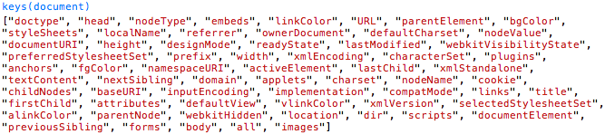

Chrome, Firefox 에서 JavaScript 개발을 하더라도 console 창에서 log(), dir() 만 사용했었다.<br />
위 동영상을 보고 console 에서 또 다른 기능 들에 대해서 알게되어 활용 할 수 있다면 JavaScript 개발을 좀더 손쉽게 할 수 있지 않을까 하는 생각이 들었다.<br />
그래서 정리를 하고 확실히 알아 두기 위해서 Posting 을 해볼까 한다.

위 동영상에서 소개 되고 있는 기능들은 목록은 다음과 같다.

* XHR
* console.time / timeEnd
* console.dir() / dir()
* $o / inspect()
* $$
* monitorEvents()
* keys() / values()
* copy()
* super-cool Opera and Firebug
* more devtools

위 동영상에서 사용되고 있는 소스는 다음과 같다.

```html
<link href='http://fonts.googleapis.com/css?family=Merriweather|Droid+Sans+Mono&v1' rel='stylesheet' type='text/css'>

<h1>be a console power-user</h1>

<ul>
	<li>XHR
	<li>console.time() / timeEnd()
	<li>console.dir() / dir()
	<li>$0 / inspect()
	<li>$$
	<li>monitorEvents()
	<li>keys()/values()
	<li>copy()
	<li>super-cool Opera and Firebug features
	<li><a href="//code.google.com/chrome/devtools" rel="prerender">more devtools</a>
</ul>
```

```css
body {
  font-family: Merriweather;
  font-size: 18px;
}

textarea {
  width: 100%;
  height: 80px;
  font-family: Droid Sans Mono;
}
```

```js
function ajax() {
  var xhr = new XMLHttpRequest()
  xhr.open('get', '/?' + Math.random(), true)
  xhr.onload = function(evt) {
    txt = document.createElement('textarea')
    document.body.appendChild(txt)
    txt.value = evt.target.response
  }
  xhr.send(null)
}

addEventListener('click', ajax, false)
```

## XHR


console 창에서 위와 같이 메뉴창을 열어서 Log XMLHttpRequests 를 선택해 두면 XMLHttpRequests 가 발생할때 마다 콘솔에 XHLHttpRequest 로그를 표시해준다.

Ajax 를 이용해서 개발을 할때 기존에는 Network 탭에서 확인하였지만 이렇게 직접 Console 에서 바로바로 Ajax 호출을 확인할 수 있어서 개발할때 좋을꺼 같다.

또 다른 사이트 분석을 할때도 어느 시점에 Ajax 를 사용하는지 쉽게 볼 수 있다.

## console.time() / console.timeEnd()

```js
function ajax() {
  console.time('ajax') //시작 지점
  var xhr = new XMLHttpRequest()
  xhr.open('get', '/?' + Math.random(), true)
  xhr.onload = function(evt) {
    txt = document.createElement('textarea')
    document.body.appendChild(txt)
    txt.value = evt.target.response
    console.timeEnd('ajax') // 끝나는 지
  }
  xhr.send(null)
}

addEventListener('click', ajax, false)
```

Javascript 소스만 위와 같이 변경을 한다.

실행을 해보면 다음과 같은 결과를 console 에서 확인 할 수 있다.


console.time console.timeEnd 는 결과와 같이 시작된 지점을 time() Method 와 끝나는 지점에 timeEnd() method 를 써주고 인자 값으로 검사하고자 하는 함수 이름을 넘겨주면 소스코드가 실행된 시간을 화면에 출력해 준다.

최근에 프로젝트를 진행하면서 for 문으로 하는것이 빠를지 jQuery 의 $.each 문으로 하는것이 빠른지 궁금했던적이 있다. 이런 경우 직접 눈으로 확인 할 수 있는 좋은 방법이라고 생각 한다.

## console.dir() / dir()

```js
function ajax() {
  var xhr = new XMLHttpRequest()
  xhr.open('get', '/?' + Math.random(), true)
  xhr.onload = function(evt) {
    txt = document.createElement('textarea')
    document.body.appendChild(txt)
    txt.value = evt.target.response
    console.log(txt) //log
    console.dir(txt) //dir
  }
  xhr.send(null)
}

addEventListener('click', ajax, false)
```

Javascript 소스만 위와 같이 변경을 한다.

실행을 해보면 다음과 같은 결과를 console 에서 확인 할 수 있다.


위와 같이 log 는 단순하게 인자값으로 넘겨준것을 console 에 반환해서 찍어주고 dir 은 인자값으로 넘겨준 값을 자세하게 그 안에 어떤것들이 들어있는지 method, property 등 을 보여준다.

HTMLTextAreaElement 앞에 화살표를 눌러보면 아래로 펼쳐 지면서 목록을 쭉 볼수 있다.
나같은 경우는 dir 을 지정한 객체가 method 를 가지고 있는지 혹은 prototype 을 공부할때 prototype 을 만들어서 상속했을때 어떻게 상속이 되는지 이런것을 확인 할때 주로 사용 했었다.

동영상 예제에서 보면 dir()을 사용하는데 이건 소스에 그대로 사용해서 쓰면 오류가 발생한다.
다음과 같은 오류가 발생한다.

<span style="color:red">Uncaught ReferenceError: txt is not defined</span>

## $0 / inspect()

먼저 inspect() method 는 console 창에서 inspect() Method 를 호출하면 인자값으로 넘겨주 Element 를 Elements 탭에서 선택된 상태로 표시해준다.
페이지 에서 마우스 오른쪽 버튼을 누르고 "요소 검사" 검사를 통해서 선택하는거와 같은 기능이다.

$0 는 inspect() 를 통해서 선택된 기준으로 $0 는 현재 선택된 Element 를 나타내고 숫자가 증가하면 이전에 선택했던 Element 를 기억하고 있다가 차례대로 반환한다.

## $$

동영상에 보면 bling bling function 이라고 부른다. 달러 표시를 그쪽에서는 그렇게 부르는듯 하다.
console 창에서 $$ 를 입력해보면 다음과 같은 function 몸체를 볼수 있다.
대략 봤을때 인자 값을 받아서 querySelectorAll Method 를 통해서 Element 를 반환해주는 함수 인거 같다.


예제로 확인해 보자. $$ 함수에 textarea 를 찾아보면 다음과 같이 textarea 를 반환해 주는것을 확인 할 수 있다.


document 상에 있는 textarea 를 배열로 반환해 준다. 현재 페이지에 textarea 가 하나밖에 없어서 하나만 나온것이고 li element 를 확인해보면 배열로 여러개의 li element 를 반환해 주는것을 볼 수 있다.

## monitorEvents()

monitorEvents 함수는 인자값으로 받은 Element 에서 발행하는 Event 를 모니터링 해주는 함수이다.

예제를 확인해 보자.


위와 같이 monitorEvents() 함수에 인자값으로 $$ 함수를 사용해서 textarea 를 넘겨주면 textarea 위에서 발생하는 마우스 이벤트, 키보드 이벤트를 확인 할 수있다.
console 에 나와 있는 화살표를 눌러서 자세하게 확인 할 수도 있다.

## keys() / values()

keys() , values() 함수는 다음 예제와 같이 인자값으로 넘겨준 값이 가지고 있는 모든 key 값과, value 값을 console 창에 반환해서 보여주는 함수이다.




## copy()

동영상에서 보면 알겠지만 copy() 함수는 console 에 보여질 내용을 보기 힘들때 반환값을 copy 해서 다른 에디터라던지 등등 옴겨서 볼때 사용하는 함수이다.

예제를 확인해 보면 copy 함수를 통해서 keys 값을 복사 하는 것을 확인 할 수있다.


## super-cool Opera and Firebug

Opera 의 [Dragonfly](http://www.opera.com/dragonfly 'Dragonfly')

FireFox 의 [Firebug](http://getfirebug.com/ 'Firebug')

이 두가지는 따로 얘기 하지 않고 링크만 걸어두겠다.

## more devtools

more devtools 는 [Chrome Developer Tools: Console](http://code.google.com/intl/ko-KR/chrome/devtools/docs/console.html 'Chrome Developer Tools: Console') 에서 console 에 대한 자세한 내용을 볼 수 있다는 설명입니다.

설명에 보면 Console 은 Firebug 의 [Command Line API](http://getfirebug.com/wiki/index.php/Command_Line_API 'Command Line API') 를 지원한다고 써 있습니다. 이곳에 가면 console 에서 사용 할 수있는 API 를 자세하게 확인 할 수 있습니다.
