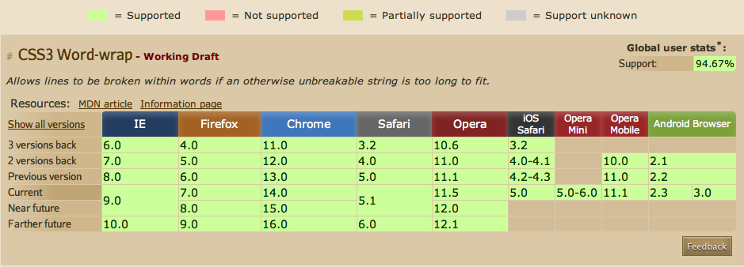

마크업 작업을 하다보면 한글은 자동으로 줄바꿈이 되는데 영문(띄어쓰기 안된경)인 경우 줄바꿈이 되지 않고 박스 밖으로 쭉 나가는 경우가 있다.

진짜 그런지 함 확인해 보자.

### 한글인 경우

<div style="border: 1px solid #000; width: 300px; height: 150px; background: #eee; margin: 10px auto">
한글한글한글한글한글한글한글한글한글한글한글한글한글한글한글한글한글한글한글한글한글한글한글한글한글한글
</div>

### 영문인 경우

<div style="border: 1px solid #000; width: 300px; height: 150px; background: #eee용; margin: 10px auto;">
http://octopress.org/blog/2011/07/23/octopress-20-surfaces/
</div>

위와 같이 영문인경우 줄바꿈이 제대로 이루어지지 않아서 박 밖으로 삐져 나가는 경우가 생겨서 놀라는 일이 생긴다. 요런 경우 css 속성중에 word-wrap 을 사용하게 되면 요 문제가 해결이 된다. 어떤 브라우저에서 지원을 하는지는 다음 링크에서 확인이 가능하다.

[caniuse](http://caniuse.com/#search=word-wrap 'can i use') 에서 확인을 해보면 다음과 같이 모든 브라우저가 지원을 하는걸 확인 할 수 있다.



자 이제 직접 적용을 해서 확인을 하면 다음과 같이 영문도 자동으로 줄바꿈이 되는것을 볼 수 있다.

소스 와 적용된 결과를 보면 다음과 같다.

```css
div{
border: 1px solid #000;
width: 200px;
height: 150px;
background: #eee;
word-wrap: break-word; /_ 요부분 추가 _/
}
```

### Word-warp 적용

<div style="border: 1px solid #000; width: 300px; height: 150px; background: #eee; word-wrap: break-word;margin: 10px auto;">
http://octopress.org/blog/2011/07/23/octopress-20-surfaces/
</div>
