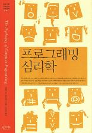

제랄드 M. 와인버그 지음, 역자조상민 옮김

<strong>책소개 -</strong> 프로그래밍도 사람이 하는 일이다!

'프로그램 프로그래밍 프로그래머' 시리즈, 제 4 권 『프로그래밍 심리학』. '프로그래밍도 사람이 하는 일'이라는 당연하지만 현실에서는 인정받지 못하는 문제 인식을 바탕으로 저술된 것이다.

이 책은 프로그래밍을 둘러싼 여러 영역의 사람들이 가지는 마음의 이치를 다루고 있다. '인간 행위로 보는 프로그래밍', '사회 활동으로 보는 프로그래밍', '개인 행위로 보는 프로그래밍' 등으로 구성하여 프로젝트를 이끌어나가는 사람과 사람 사이의 관계뿐 아니라, 사람과 코드와의 관계, 사람과 도구와의 관계에 대해서도 살펴본다.

그러한 작업을 통해 프로그래머는 스스로 마음을 가진 존재로서 정당한 대우를 받고 있는지에 검토하고 있다. 그외 프로그래머의 성격과 훈련과 경험이 프로그래밍에 주는 영향 등의 흥미로운 연구를 다룬다. 양장본.

## 프로그램 읽기

> 프로그램 읽기는 여전히 프로그래밍의 과정을 이해하는 중요한 열쇠다. - p.47

예전부터 개발자로서 도움이 되는지 안되는지 궁금했던 부분이다.
다른 사람의 소스를 읽으면 나에게 도움이 될까? 라는 의문을 가지고 있었다.
이책에서 그부분에 대한 해답을 찾아 주었다.
사람들이 책을 읽으면서 저자의 생각을 보고 느끼듯이 다른 사람의 소스 코드를 읽는것 또한 비슷하다고 생각한다. 소스를 읽으면서 왜 이렇게 코딩을 했는지 분석하는 것도 좋은 개발자로 발전하는 방법이라는 결론을 가지게 되었다. 처음에는 암호 같던 코드들이 한눈에 들어 오고 이해가 될때 그 희열감이란 해본 사람만 안다.
이제 jQuery 소스 분석을 계속 해야할 이유가 생겼다.
고마운데? 훗!!!

## 좋은 프로그램이란 무엇인가?

> 우리는 어떤 프로그램을 다른 프로그램과 비교해 상대적으로 평가하기보다는 개발에 관련된 모든 상황에 비추어 그 프로그램을 평가 해야 한다. 그리고 솔직히 말해서, 우리가 원하는 것은 최고의 프로그램이 아니다. 사실 우수한 프로그램조차도 아니다. 우리가 원하는 것은 요구 명세에 부합하는 프로그램이다. - p.51

프로그래밍 언어는 종류가 너무 많다. 최근에도 구글에서는 2 개의 언어를 발표 했다.
기존에 있는 언어로도 충분히 만들고자 하는것을 다 만들수 있는데 왜 시간을 들여서 새로운 언어를 만드는지 이해 할 수 없다.
이 언어는 이런게 좋고 저 언어는 저런게 좋고... 언어가 좋으면 몰하나 정작 개발자가 제대로 코딩하지 않으면 그것도 안좋은 언어 아닌가? 한국말을 잘써야 좋은 말이지 한국말로 욕을 잘하면 좋은 말인가?

프로그래밍 언어는 그냥 컴퓨터와 대화하기 위한 수단일뿐 좋고 나쁜것이 없다고 생각한다. 그냥 주어진 언어로 이쁘게, 멋지게 코딩해서 컴퓨터와 대화하면 그만 아닐까? ㅋ;
