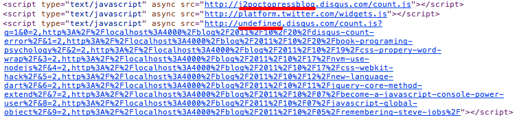
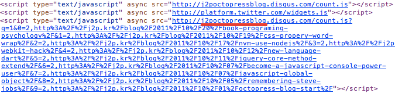

Octopress 에 \_config.yml 파일에 disqus_show_comment_count 옵션을
true 로 해줬음에도 해당 포스트의 comment count 가 제대로 나오지 않고 있었다.

일시적인 오류라 생각하고 그대로 두었는데 누군가 comment 를 쓰더라도 계속 0 으로 표시되니까 누가 comment 를 썼는지 안 썼는지 알수 없었다.

그래서 수정을 해볼려고 소스를 살펴 보았다.



위와 같이 첫번째 부분에는 정상적으로 disqus_short_name 이 url 에 들어가 있다.
두번째 두분에는 undefind 값이 들어가 있어서 정상적으로 불러오지 못하는것이였다

그래서 해당 소스가 들어가 있는 부분을 찾아보니 source/\_includes/disqus.html 에 JavaScript 소스가 있었다.
소스는 다음과 같은 script 를 소스를 추가 해주는 내용이였다.

```html
<script type="text/javascript" async="" src="http://j2poctopressblog.disqus.com/count.js"></script>
```

http://j2poctopressblog.disqus.com/count.js 소스를 확인해 보면 또 새로운 script 소스를 생성해서 추가해주는것을 알 수 있다.
그렇다면 두번째 script 의 undefined 에 들어가야할 disqus_shortname 에 제대로 접근을 하지 못하고 undefined 값이 들어간다는 것이다.

disqus 사이트에 가서 comment count 에 대한것을 찾아보면 다음과 같은 예제 소스를 확인 할 수 있다.
여기서 보면 disqus_shortname 이 익명 함수 밖에 전역으로 선언되어 있는것을 확인 할 수있다.

```html
<script type="text/javascript">
    /* * * CONFIGURATION VARIABLES: EDIT BEFORE PASTING INTO YOUR WEBPAGE * * */
    var disqus_shortname = 'example'; // required: replace example with your forum shortname

    /* * * DON'T EDIT BELOW THIS LINE * * */
    (function () {
        var s = document.createElement('script'); s.async = true;
        s.type = 'text/javascript';
        s.src = 'http://' + disqus_shortname + '.disqus.com/count.js';
        (document.getElementsByTagName('HEAD')[0] || document.getElementsByTagName('BODY')[0]).appendChild(s);
    }());
</script>
```

하지만 source/\_includes/disqus.html 소스를 확인해보면 익명 함수 안에 disqus_shortname 변수가 선언 되어 있는 것을 확인 할 수 있다. 그래서 저 변수에 접근을 못해서 url 에 undefinde 값이 들어가는 것이였다.

source/\_includes/disqus.html 에서 disqus_shortname 변수를 전역으로 빼주면 간단하게 수정이 된다.




위와 같이 소스에도 disqus_shortname 이 들어가서 정상적인 url 을 표시해주고 post 에도 count 가 나오는것을 볼수 있다. 수정하고 안것이지만 reactions count 도 같이 나온다.
