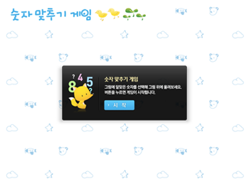

예전에 FRENDS 에서 [Cappuccino](http://cappuccino.org/ 'Cappuccino') 스터디 진행할때 참여해서 졸업작품으로 만들었던 숫자 이미지 찾기 게임이다.
집에 애기가 있어서 인지 아기를 위한 게임을 만들어보고 싶어서 만들었던 것이다.
만들고 난 후에 손도 안대고 어딘가에 숨어있던 것을 한번 꺼내봤다.

진행 방식은 화면에 숫자와 동물 이미지가 나오면 동물의 마리 수를 확인해서 숫자를 동물에 잡아서 끌어다 옮기는 방식이다. 숫자가 맞으면 O 틀리면 X 가 화면에 표시된다.

만들때 아는 디자이너분 한테 말해서 동물이미지 숫자이미지 만들어 달라고 했던것이 생각난다. 다시한번 감사에 말씀을 전하고 싶다.ㅋ;

[Cappuccino 졸업작품](/cappuccino 'Cappuccino 졸업작품')
첫번째 시작할때 소스 받느라고 로딩이 좀 깁니다. 인내심을 갖고 기다려주세요

소스는 [github](https://github.com/J2P/Objj_study 'github') 에서 확인 할 수 있습니다.
