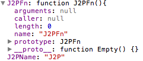
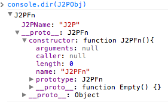

JavaScript 를 개발할때 사용하거나 공부를 할때 해깔리고 어려운 부분중에 하나인 <strong>this</strong>에 대해서 내가 아는 부분을 정리해 볼까 한다.

나 또한 <strong>this</strong>에 대해서 많은 부분 해깔려 하던중 FRENDS 의 AJ([@andrwj](https://twitter.com/#!/andrwj 'andrwj'))의 강의를 듣고 확실한 개념을 잡을 수 있었다.

AJ([@andrwj](https://twitter.com/#!/andrwj 'andrwj'))가 말하는 <strong>this</strong>는 아주 간단했다.
한마디로 정의 하면 다음과 같다.

* Method 를 호출한 녀석
* 쩜(.) 앞에 녀석

그래도 몬지 잘 모를 수도 있고 오!! 라고 하며 감탄사를 내 뱉을 수도 있다. 지금 부터 예제를 통해서 <strong>this</strong> 에 대해서 알아보자.

먼저 함수 몸체에서 사용되는 <strong>this</strong> 를 알아보자.
내가 처음 <strong>this</strong> 에 대해서 알게 되었을때 제대로 알지 못하고 함수 안에서 사용하게 되면 그 함수의 property 가 되는줄 알고 사용 했던 적이 있다. 하지만 확인을 해보면 함수 몸체에서 사용한 <strong>this</strong>는 window 를 갈이 키는 것이다.

다음 소스코드를 확인해보자.

```js
function J2PFn() {
  this.J2PName = 'J2P'
}

J2PFn()

console.dir(window) //콘솔창에서 확인
```



window method 에 window.J2PFn 이 있는것을 확인 할 수 있다. 어라? 근데 window.J2PName 도 같이 있다. 보통 생각했던 결과는 J2PFn 함수 안에서 this 가 갈이키는 것은 당연히 함수자신(J2PFn)라고 생각을 한다.

함수를 실행 할때 J2PFn(); 이렇게 실행을 한다. 하지만 결국 이것은 window.J2PFn() 하는것과 마찬가지 인 것이다.
그렇다면 처음에 정의했던데로 생각해보자.

"Method 를 호출한 녀석" 즉 J2PFn() 을 호출한 window 가 되는것이고 또 "쩜 앞에 녀석" .J2PFn() 앞에 있는 window 가 되는것이다.

이제 두번째 예제를 보자. 함수의 몸체에 사용하는것은 위에 예제와 똑같다. 하지만 new 연산자로 객체를 생성하였다.
객체를 생성하게 되면 함수 몸체에 있던 <strong>this</strong> 는 인스턴스된 객체에 property 가 된다.
그래서 처음에 우리가 생각했던 J2PObj.J2PName 으로 접근이 가능하게 된다.

다음 소스코드를 확인해보자.

```js
function J2PFn() {
  this.J2PName = 'J2P'
}

var J2PObj = new J2PFn()

console.dir(J2PObj) //콘솔창에서 확인
```



처음 우리가 생각했던 <strong>this</strong>가 바로 요런것이 였을것이다.

위 2 개의 예제에서 볼 수 있듯이 함수 안에서 사용되는 <strong>this</strong>는 인스턴스가 되지 않으면 우리가 생각했던 this 가 되지 않는 것이다.

이제 세번째 예제를 보자. 세번째 예제는 Element 에서 이벤트를 발생할때 사용되는 <strong>this</strong> 이다.
어쩌면 이것이 가장 많이 사용되는지도 모르겠다.

다음 소스코드를 확인해보자.

```html

```

click 이벤트가 발생한 경우 함수를 호출 할때 <strong>this</strong>를 인자 값으로 넘겨주는 경우가 있을것이다.
또 mouseover 이벤트가 발생할 경우에도 image 의 src 를 변경해서 이미지를 변경시키는 경우에도 this.src 라는 값일 인자로 넘겨주기도 할 것이다.

그렇다면 여기서 <strong>this</strong>는 무엇인가? 요부분을 해깔려 하는 경우가 있을 것이다.
자세히 보면 정말 간단하다. click 이벤트나 mouseover 이벤트는 img 가 호출을 시킨것이다. 그리고 이벤트를 element 에 써주지 않고 따로 스크립트에서 처리는 한다면 더 명확하게 알 수 있다. 다음 소스를 보자.

```html
<a id="blog-link" href="http://j2p.kr">J2P</a>

<script type="text/javascript">
  document.getElementById("blog-link").onclick = function(){
  	console.log(this);

  	return false;
  }

  document.getElementById("blog-link").addEventListener("mouseover", function(){
  	console.log(this);
  }, false);
</script>
```

이제 처음에 말했다 <strong>this</strong>의 정의 대로 해석해 보자.

"Method 를 호출한 녀석" onclick 를 호출한 녀석이 누구인가? 바로 blog-link 아이디 값을 가지고 있는 Element a 태그이다.

쩜(.) 앞에 녀석 .onclick 앞에 있는 녀석은 누구인가? document.getElementById("blog-link") 이다.

소스코드에서 두번쨰 addEventListener 땜에 해깔릴수도 있을거 같은데 결국 저것도 mouseover 이벤트를 걸어주는것이기 때문에 mouseover 이벤트가 실행될때를 생각해보면 <strong>this</strong> 정의한 것으로 생각해보면 똑같은 결과가 나온다.

이렇게 <strong>this</strong>에 대한 설명이 끝났다 사실 경우가 더 있지만 위에 3 가지 정도만 알고 있다면 다른 <strong>this</strong>를 의해는데는 그렇게 크게 어렵지 않을꺼라 생각한다. 무엇보다 가장 쉬운 방법은 console.log 찍어보는 눈으로 확인하는것이라고 생각한다.
