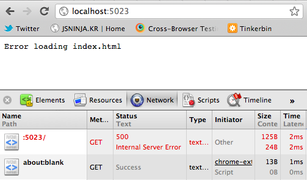
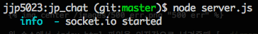
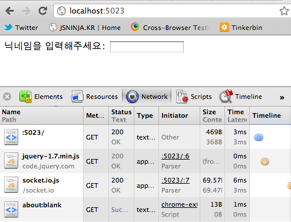

그동안 Node.js 에 대해서 맨날 보기만 하다가 H3 채팅을 보고 직접 만들어 보고 싶다는 생각이 들었다.
그래서 간단한 채팅을 만들어 볼려고 한다.

오늘은 기본적인 web server 구동을 시작해보겠다. 아래 소스는 github Repositorie 에 올리면서 진행하려고 한다. nodester 에서 호스팅을 받아서 nodester 쪽에서도 확인해볼수 있다.

* [https://github.com/J2P/j2p_chat](https://github.com/J2P/j2p_chat 'github')
* [http://j2p_chat.nodester.com/](http://j2p_chat.nodester.com/ 'nodester')

먼저 채팅을 만들기 위해서 기본적으로 socket 통신을 해야 하므로 npm 을 이용해서 socket.io 를 설치했다.

```bash
$ npm install socket.io
```

socket.io 를 설치하면 examples 디렉토리 안에 chat 이 있는데 express 이외에도 많은 모듈을 사용해서 만들어져있다. 나는 단순한 socket 통신을 하는거만 보기 위한거라서 다른 모듈 없이 socket.io 만 사용해서 만들어 볼려고 한다. 소스는 socket.io/examples/chat 소스를 바탕으로 작업을 했다.

우선 가장 기본적인 부분인 Web Server 구현해 볼려고한다.

필요한 파일은 서버쪽 server.js 파일과 클라이언트 페이지 index.html 이 필요하다.

## Server.js

서버쪽에서 Web Server 가 구동되야 하므로 server.js 에 다음을 추가한다.

```js
var app = require('http').createServer(handler).listen(5023)
, io = require('socket.io').listen(app)
, fs = require('fs');

function handler(req, res){
  fs.readFile(\_\_dirname + '/index.html', function (err, data) {
    if (err) {
      res.writeHead(500);
      return res.end('Error loading index.html');
    }

    res.writeHead(200, { 'Content-Type': 'text/html'});
    res.end(data);
  });
}
```

대략 소스를 보면 http, socket.io, fs 모듈을 사용하고 있다.

여기서 http 모듈은 서버를 생성할때 handler 함수를 인자값으로 넘겨줘서 서버를 Web Server 를 생성하고 port 5023(port 번호는 마음대로 설정해도 된다) 으로 접근할수 있게 설정했다.

handler 함수는 예전부터 가장 궁금했던 부분중에 하나인 html 파일을 어떻게 보여주는지 궁금했었는데 그부분을 구현한 함수 부분이다. fs 모듈을 이용해서 index.html 파일을 읽어서 보여주게 된다.

파일을 읽는중 문제가 생기게 되면 다음과 같이 500 에러가 발생하고 메시지를 보여주게 된다.



handler 함수에서 fs.readFiel() method 에 index.html 파일을 인자값으로 넘겨줄때 [\_\_dirname](http://nodejs.org/docs/v0.6.1/api/globals.html#__dirname '__dirname') 이 있는데 nodejs doc 에서 확인을 해보면 \_\_dirname 은 node.js 의 global Object 로 현재 스크립트파일의 위치를 담고 있는 객체인걸 알 수 있다.

socket.io 모듈은 listen Method 는 인자값으로 http 모듈을 담고 있는 app 변수를 넘겨준다.
나름 해석해보면 socket.io 가 Web Server 를 항상 듣고 있는 모 그런거 같다 ㅋ;;.

## index.html

server.js 에서 index.html 을 읽어들여서 보여주기 위해서 index.html 에 간단한 닉네임 입력창을 넣어준다.

```html
<!DOCTYPE html>

<html>
<head>
	<meta charset="utf-8">
	<title>JP Chat</title>
	<script src="http://code.jquery.com/jquery-1.7.min.js"></script>
	<script src="/socket.io/socket.io.js"></script>
</head>
<body>
	<form id="set-nickname">
		<label>닉네임을 입력해주세요: </label><input type="text" id="nick" />
	</form>
	<div id="nicknames"></div>
</body>
</html>
```

클라이언트에서도 jQuery & socket.io 를 쓰기위해서 jquery-1.7.min.js 와 socket.io.js 를 추가해 주었다.

그러면 Web Server 가 잘 동작하는지 확인해 보자. 터미널에서 다음과 같이 서버를 시작하고 브라우져에서 확인해보자.



브라우져에서 확인해보면 다음과 같이 input 박스를 확인할수 있다.



다음엔 닉네임 입력을 하고 채팅방에 join 하는 것을 구현해 보겠다.
