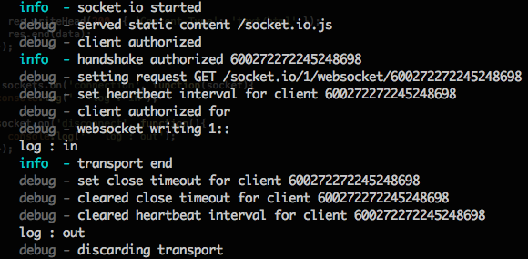

오늘은 socket.io 를 사용해서 서버와 통신(connection, disconnection)이 어떻게 가능한지 확인해볼까 한다.

먼저 서버와의 통신을 확인하기 위해서 다음과 같이 server.js 와 index.html 소스를 수정한다.

```js
var app = require('http')
    .createServer(handler)
    .listen(5023),
  io = require('socket.io').listen(app),
  fs = require('fs')

function handler(req, res) {
  fs.readFile(__dirname + '/index.html', function(err, data) {
    if (err) {
      res.writeHead(500)
      return res.end('Error loading index.html')
    }

    res.writeHead(200, { 'Content-Type': 'text/html' })
    res.end(data)
  })
}

// 기존 소스에 이부분 추가
io.sockets.on('connection', function(socket) {
  console.log('log : in')

  socket.on('disconnect', function() {
    console.log('log : out')
  })
})
```

```html
<!DOCTYPE html>
<html>
<head>
	<meta charset="utf-8">
	<title>JP Chat</title>
	<script src="http://code.jquery.com/jquery-1.7.min.js"></script>
	<script src="/socket.io/socket.io.js"></script>
</head>
<body>
	<form id="set-nickname">
		<label>닉네임을 입력해주세요: </label><input type="text" id="nick" />
	</form>
	<div id="nicknames"></div>
	<script>
    //socket connect script 추가
		var socket = io.connect('http://localhost:5023');
	</script>
</body>
</html>
```

Server, Client 소스에 socket 통신을 하기 위해서 추가된 부분이 있다 어떤 동작을 하는지 눈으로 확인해 보도록 하겠다.

socket.io 사이트에 [how to use](http://socket.io/#how-to-use 'how to use') 에서 확인을 해보면 다음과 같은 부분이 있다.

> Besides `connect`, `message` and `disconnect`, you can emit custom events

해석해 보면 connect, message, disconnect 외에도 다른 이벤트를 만들어서 사용할 수 있다는 내용이다. 기본적으로 제공되는 event 인 connect, disconnect 를 통해서 Server 와 Client 사이에 통신이 가능한지 확인해보자.

socket.io 사이트에서 예제 소스를 보면 Server 와 Client 가 connection 이 이루어져야 socket 통신이 가능하다는걸 알 수 있다.

index.html 파일을 보게 되면 io.connect() method 에 socket 통신을 하고자 하는 Server url 을 넘겨 connect event 를 호출하게 된다.

Server 에서는 connection 이벤트를 호출하게 되어 함수를 호출하게 되고 터미널에는 **log : in** 이 찍히게 된다. disconnect 이벤트는 connect 이벤트 안에 있는걸 볼 수 있는데 이것은 단순하게 생각하면 접속을 해야 접속을 끊는 것도 가능하기 때문이라고 생각한다. 그래서 disconnect event 가 발생하게 되면 터미널에 **log : out** 을 찍게 된다.

그럼 connection, disconnect 가 이루어질때 터미널에 로그가 남는지 확인해보자.



위 화면과 같이 index.html 에 접속했을때 **log : in** 을 터미널에서 확인 할 수 있고, 페이지를 나오게 되면 **log : out** 을 터미널에서 확인 할 수 있다.

이렇게 해서 socket.io 를 통해서 Server 와 Client 사이에 connection, disconnection 이 이루어 지는걸 확인 할 수 있었다.

이제 Server 와 Client 사이에 socket 통신이 가능 하게 되었다.
