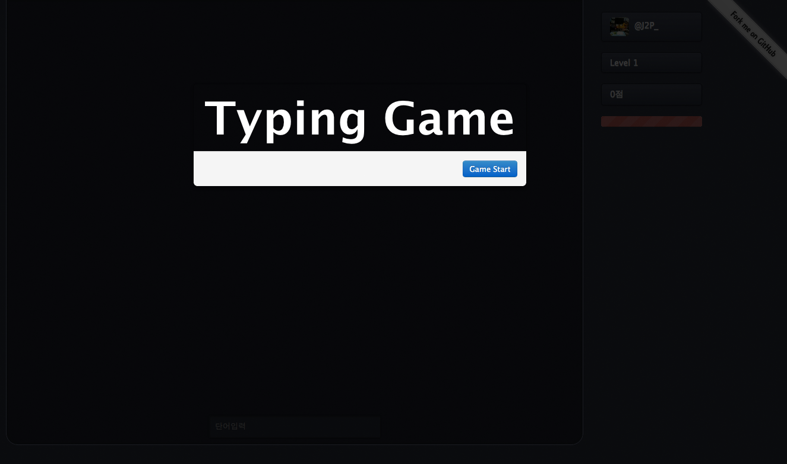
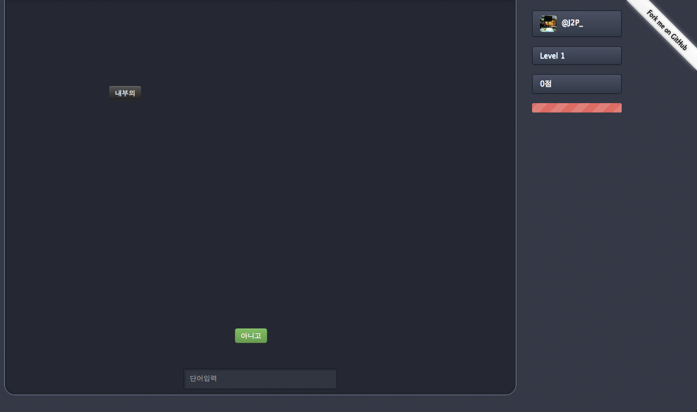

지난달 3 월 30 일 저녁 10 시부터 3 월 31 일 저녁 10 시까지 [FRENDS Hackathon 2012](http://frends.kr/topics/frends-hackathon-2012/ 'FRENDS Hackathon 2012') 을 했다.

예전 한글과 컴퓨터에 포함되었던 산성비 게임을 웹으로 만들어 보면 재미있지 않을까해서 주제를 산성비 게임으로 정하고 만들어 보았다.

사실 3 월에는 둘째 출산으로 인해서 힘든 상태에 여러 귀차니즘이 발동을 해서 Hackathon 참여를 포기하고 있던 상태에 ([@Rhiokim](https://twitter.com/#!/Rhiokim '@Rhiokim'))님 의 도움을 받아서 마지막에 겨우 겨우 다시 진행하게 되어 살짝이나마 결과를 낼수 있었다.

사용했던 기술은 Node.js 서버, express 프레임웍을 사용했고, 로그인 구현을 위해서 [passport](http://startic.kr/njs/package/passport 'passport') ([passport-twitter](http://startic.kr/njs/package/passport-twitter 'passport-twitter'), [passport-facebook](http://startic.kr/njs/package/passport-facebook 'passport-facebook')) 모듈을 사용했다.
또 디자인이 약한 개발자인 지라 [Bootstrap](http://twitter.github.com/bootstrap/ 'Bootstrap')으로 기본 화면을 꾸며 봤다.

소스는 github repository 에 올려서 관리를 했다.
([@Rhiokim](https://twitter.com/#!/Rhiokim '@Rhiokim'))님 덕분에 github 를 사용하는 방법을 많이 배울 수 있었다.

Issues 에 Issue 를 등록해서 Milestone 계획을 잡아 기능을 하나씩 구현해 나가는 방법은 머리로만 생각해서 작업을 진행하지도 못하고 해매고 있던 나에게는 더 없이 좋은 방법이 였고, github 에서 프로젝트를 관리 할 수 있는 좋은 방법이였다. 이번 Hackathon 을 통해서 가장 크게 배운점이 프로젝트를 진행해 나가는 방법이 아닐까 싶다.

아직은 v0.1.0 이라서 기본적인 기능만을 구현했지만 Hackathon 이 끝났다고 해서 버려두지 말고 기능을 계속추가해 나가면서 발전시켜볼까 한다.

* 소스는 [https://github.com/J2P/typing](https://github.com/J2P/typing 'https://github.com/J2P/typing') 에서 볼수 있습니다.
* 게임은 [http://typing.j2p.kr](http://typing.j2p.kr 'http://typing.j2p.kr') 에서 직접 해볼수 있습니다.
