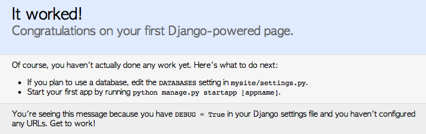

새로운 회사에 입사를 하게 되어 Django 프레임웍 를 이용해서 개발을 하게 되었다.

아직 Python 을 써본적도 없고 Django 프레임웍은 더더욱이나 써본일이 없다.

사실 프레임웍 자체가 아직은 낮설다. 그래도 모든 새로운걸 배우는건 재밌는 일이기에 매일 매일 즐겁게 배우고 있다.

그래서 ["쉽고빠른 웹 개발 Django(인사이트)"](http://ebook.insightbook.co.kr/ebooks/4f8bbcd0bf6e106c49000002 '쉽고빠른 웹 개발 Django(인사이트)') EBook 을 구매해서 하나하나 따라해 보고 있다.

기본적으로 Django 프레임웍 은 Python 으로 만들어진 프레임웍 이기 때문에 Python 이 설치 되어 있어야 한다.

## 가상환경생성

Python 개발 환경은 @lqez 님이 블로깅해주신 [virtualenv / virtualenvwrapper](http://blog.naver.com/ez_/140138625021 'virtualenv / virtualenvwrapper')을 보고 따라서 설정했다.

virtualenvwrapper 을 설치 했으면 하나의 가상환경을 만들어 보자.

```bash
$mkvirtualenv mysite
```

## Django 설치다음은 Django 를 설치한다.

설치는 pip 를 사용해서 설치를 한다. 현재 버전은 1.4 이다. 이전 버전을 사용하고 싶으면 두번째 줄과 같이 해서 설치하면 된다.

```bash
$pip install django
$pip install django==1.3.1
```

Django 가 설치가 다 되었으면 설치가 잘되었는지 확인을 해보자.
다음과 같이 django-admin.py 명령어를 통해서 version 을 확인해보자.

```bash
$django-admin.py --version
1.4
```

## 프로젝트 생성이제 Django 설치가 제대로 되었으니 새로운 프로젝트를 생성해보자.

적당한 디렉토리에 다음과 같은 명령어로 새로운 Django 프로젝트를 생성해보자.

```bash
$django-admin.py startproject project-name
```

프로젝트를 생성하면 project-name 라는 디렉토리에 다음과 같이 파일이 구성된다.

```bash
manage.py(file)
project-name(directory)
**init**.py(file)
settings.py(file)
urls.py(file)
wsgi.py(file)
```

생성된 파일들이 어떤 역할을 하는지 알아보자. 내용은 책에서 참고 했다.

* manage.py : django-admin.py 와 같이 프로젝트를 관리하는 스크립트 이다.
* \_\_init\_\_.py : 이 파일은 디렉터리를 파이썬 패키지로 만들어 준다.
* settings.py : Django 프로젝트를 설정한다. 데이터베이스, 언어 등을 설정한다.
* url.py : url 주소와 Django 의 기능을 연결시켜주는 역할을 한다.
* wsgi.py : wsgi 을 설정하는 파일이다. 1.4 버전에 추가되었다.

## 애플리케이션 생성이제 프로젝트를 생성했으니 새로운 애플리케이션을 하나 만들어 보자.

다음과 같은 명령어로 새로운 애플리케이션을 생성한다.
애플리케이션 이름은 상황에 맞게 이름을 정하면 된다.

```bash
$django-admin.py startapp app-name
```

## 서버실행 확인이제 서버를 실행해보자. 서버는 다음과 같은 명령어를 사용해서 실행할수 있다.

기본적으로 포트는 8000 번으로 실행된다. 포트번호를 바꾸고 싶으면 두번째 줄과 같이 실행하면 된다.

```bash
$python manage.py runserver
$python manage.py runserver 3000
```

이제 브라우저에서 http://localhost:8000 으로 확인을 해보자.


