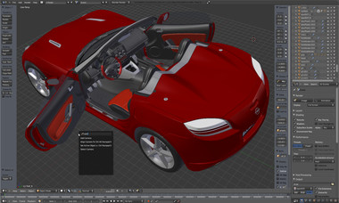

[Blender](http://http://www.blender.org/)란 무료로 사용할 수 있는 3D 그래픽 프로그램이다.

오픈소스 진영의 대표적인 그래픽 프로그램이라고 한다.

윈도우, 맥, 리눅스등 여러 운영체제를 동시에 지원 하기 때문에 운영 체제가 달라도 작업들을 쉽게 공유 가능하다고 한다.

3D 모델링툴에 비해 매우 배우기 쉬우면서 높은 수준의 렌터링 퀄리티를 보여준다고 한다.

애니메이션, 파티클, 텍스쳐 페인팅, 옷감 시뮬레이션, 스컬핑 등 값비싼 사용 프로그램에서 쓸 수 있는 기능을 거의 다 쓸 수 있으며 자체 게임 엔진을 내장하고 있다고 한다.

이외 간단한 음향/영상 편집이나 복잡한 노드 합성 기능까지 내장하고 있다고 한다.

스크립트로 3D 게임을 만들 수 있지만 게임 전용툴이 아니다 보니 복잡한 게임일수록 스크립트 노가다를 해야 하고 퍼포먼스가 좋지 않다고 한다.

[Unity3D](http://korea.unity3d.com/) 엔진이 Blender 파일을 지원하기 때문에 게임을 개발하기 위해서는 Unity3D 엔진을 사용하는게 좋다고 한다.

출처 : [엔하위키 미러](http://mirror.enha.kr/wiki/Blender)

## 특색

* Interface

## 참고 할만한 사이트 모음

### 국내

* [FLASH FRIEND BLender 강좌 목차](http://flashfriend.tistory.com/4552)
* [네이버 Blender3D 카페](http://cafe.naver.com/blender3d.cafe)
* [FEVERLOGIC Blender 게시판](http://www.feverlogic.com/index.php?mid=a02)

### 해외

* [Blender Guru](http://www.blenderguru.com/)
* [Blender open material](http://matrep.parastudios.de/)
* [Blender Cookie](http://cgcookie.com/blender/)
* [Blender swap](http://www.blendswap.com/)
* [Blenderartists.org](http://www.blenderartists.org/forum/)
* [Blender 3D Design Course](http://gryllus.net/Blender/3D.html)
