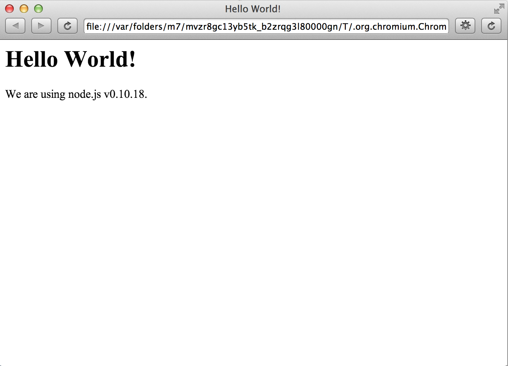

갑자기 만들어 보고 싶은게 생겼는데 [node-webkit](https://github.com/rogerwang/node-webkit)으로 만들면 괜찮을꺼 같아서 사용해 볼까 한다.

일단 난 mac 를 사용하니까 mac 에서 실행하는 방법을 알아보자.

## Downloads

* Linux: [32bit](https://s3.amazonaws.com/node-webkit/v0.7.5/node-webkit-v0.7.5-linux-ia32.tar.gz) / [64bit](https://s3.amazonaws.com/node-webkit/v0.7.5/node-webkit-v0.7.5-linux-x64.tar.gz)
* Windows: [win32](https://s3.amazonaws.com/node-webkit/v0.7.5/node-webkit-v0.7.5-win-ia32.zip)
* Mac: [32bit, 10.7+](https://s3.amazonaws.com/node-webkit/v0.7.5/node-webkit-v0.7.5-osx-ia32.zip)

위 링크에서 다운로드를 받아서 압축을 풀고 Applications 디렉토리로 이동시킨다.

## alias 등록

사용하기 편하게 .bash_profile 에 alias 를 등록한다.

```bash
#alias to nw
alias nw="/Applications/node-webkit.app/Contents/MacOS/node-webkit"
```

## 앱 실행

nw 명령어를 치면 다음과 같은 창을 볼수 있다

```bash
$ nw
```


## Quick Start

https://github.com/rogerwang/node-webkit 에 있는 Quick Start 소스를 따라서 앱을 하나 만들어보자.

디렉토리를 하나 만들어서 index.html, package.json 파일을 생성하고 아래와 같은 내용을 넣어준다.

```html
<!DOCTYPE html>
<html>
  <head>
    <title>Hello World!</title>
  </head>
  <body>
    <h1>Hello World!</h1>
    We are using node.js <script>document.write(process.version)</script>.
  </body>
</html>
```

```js
{
  "name": "nw-demo",
  "main": "index.html"
}
```

앱을 실행 하기 위해서 app.nw 파일로 압축을 한다.

```bash
$ zip app.nw index.html package.json
adding: index.html (deflated 30%)
adding: package.json (deflated 8%)
```

위와 같이 하면 app.nw 파일이 생성된걸 확인 할 수 있다.
이제 실행해 보자.

```bash
$ nw app.nw
```

앱을 실행 하면 다음과 같은 창을 볼수 있다.



근데 파일을 수정할때 마다 압축을 시켜서 앱을 실행을 하려니 너무 귀찮은 것이다.

그래서 [Haroopad](http://pad.haroopress.com/user.html) 를 만든 [Rhiokim](https://twitter.com/Rhiokim) 에게 문의를 해서 앱을 실행하는 다른 방법을 알아 냈다.

압축할 필요없이 다음과 같이 앱 디렉토리를 압축한 파일 대신 써주면 디렉토리에서 파일을 찾아서 앱을 실행해준다.

```bash
$ nw node_webkit_test_app/
```
