어렸을때부터 그림을 그림을 배우고 싶었지만 여러 사정에 의해서 그림을 배우지 못했다.

최근 그림을 배우고 싶다는 생각이 커져서 큰맘을 먹고 그림을 배우기 시작했다.

학원을 다니는건 아니고 그냥 몇개씩 그려서 회사 디자이너분에게 모가 잘못되었는지 확인을 부탁하고 있다.

(커피와 함께...)

그림을 배운지 이제 10 일 정도 지나 처음 그렸던거 부터 쭉 나열해서 보면 어떨까 싶어서 블로그에 올려본다.

(창피하지만...)

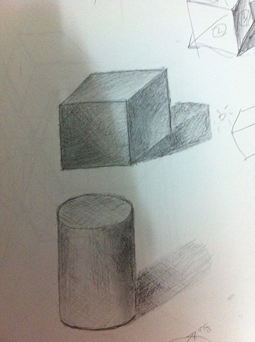

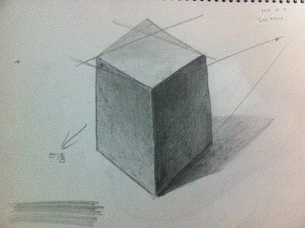

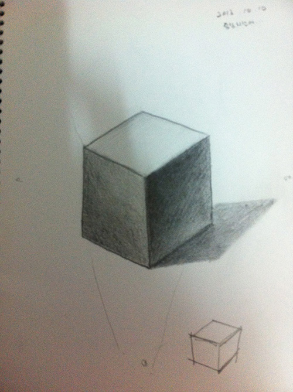

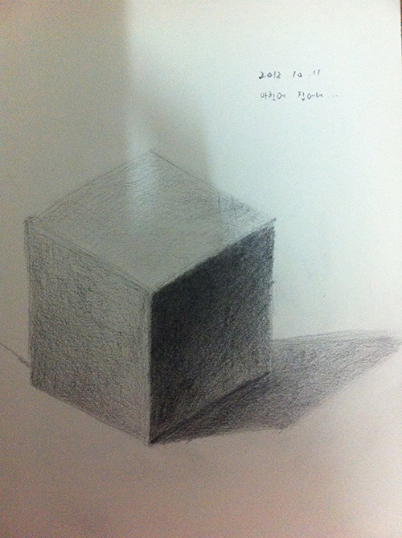

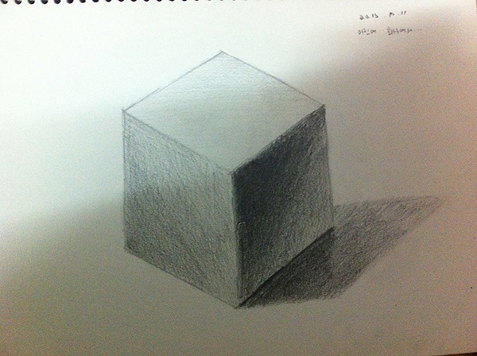

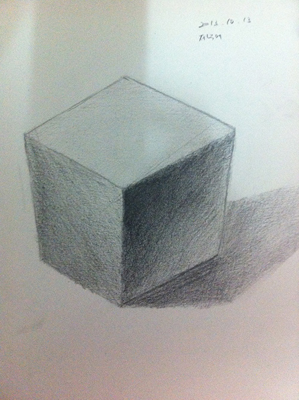

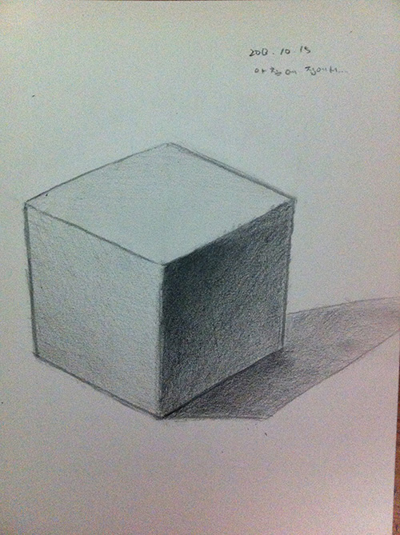

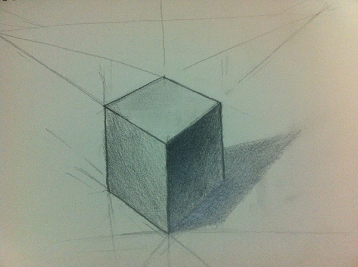

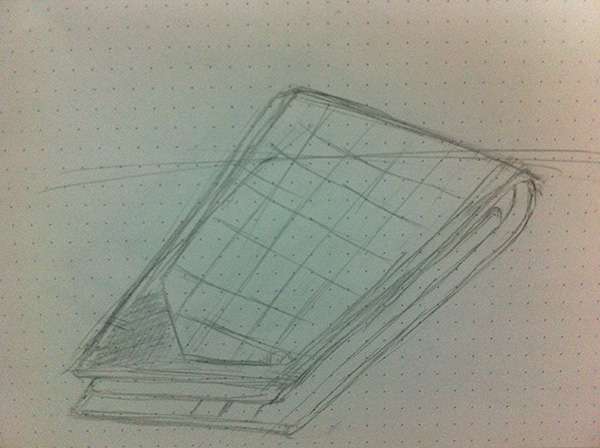

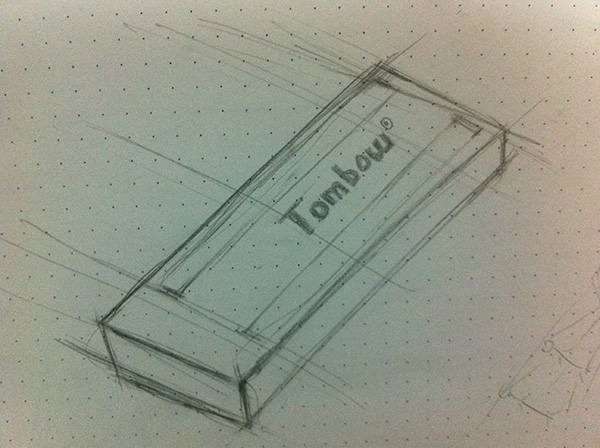

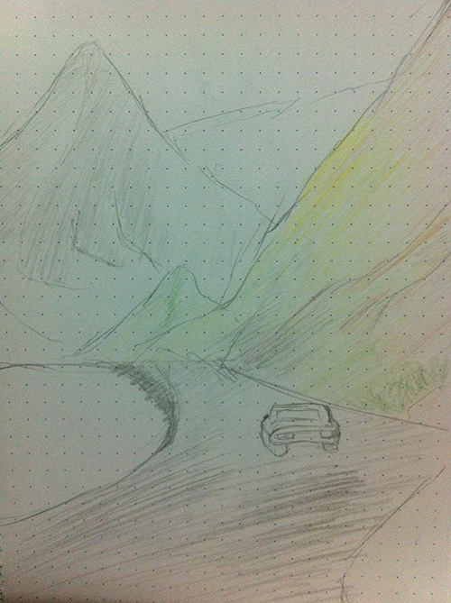

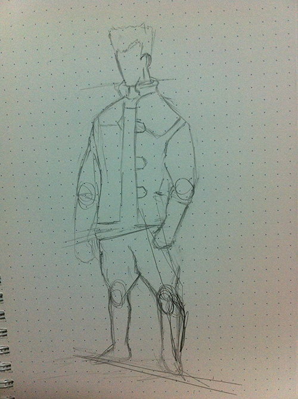
