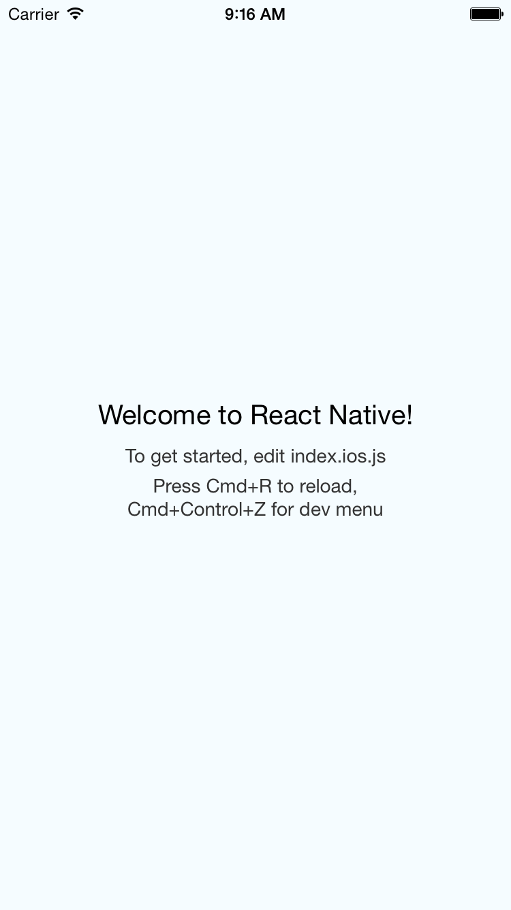

## 설치

```bash
$ npm install -g react-native-cli
```

## 프로젝트 생성

```bash
$ react-native init testProject
```

## 프로젝트 실행

```bash
$ cd testProject
$ open testProject.xcodeproj
```

위와 같이 명령어를 치면 xcode 에서 testProject 가 열립니다.

run 을 실행하면 build 가 되고 터미널 창이 하나 열리면서 서버가 실행이 된다.

그리고 iOS Simulator 이 실행되고 다음과 같은 화면을 확인 할 수 있다.



만약 xcode 에서 run 해서 터미널창이 열리는게 싫으면 testProject 디렉토리에서 다음과 같은 명령어로 서버를 실행 할 수 있다.

```bash
$ react-native start

or

$ npm start
```
