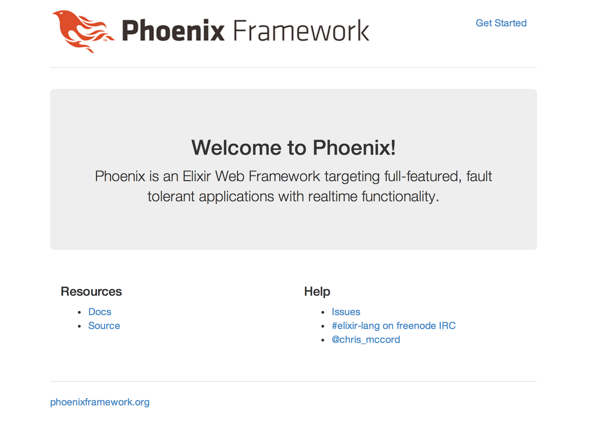

## Install Elixir

```bash
$ brew update
$ brew install elixir
```

## Install Hex

`Package manager for the Erlang ecosystem`

Hex 는 elixir, erlang 패키지를 관리해주는 시스템이다. node 의 `npm` 이랑 같은거다.

```bash
$ mix local.hex
```

## Install Phoenix Framework

phoenix 를 설치 하기 위해서 아래와 같은 명령어를 입력한다.

```bash
$ mix archive.install https://github.com/phoenixframework/archives/raw/master/phoenix_new.ez
```

## Create Phoenix Project

* phoenix 는 brunch 를 사용하고 있는거 같다. 사용하고 싶지 않으면 옵션으로 `--no-brunch`를 주면 된다.
* phoenix 는 ecto 를 사용하고 있는거 같다. 사용하고 싶지 않으면 옵션으로 `--no-ecto`를 주면 된다.
* phoenix 는 `PostgreSQL`을 기본으로 사용하게 되어 있는데 `MySQL`을 사용하고 싶으면 `--database mysql` 옵션을 추가 해주면 된다.

ecto 는 database 관리, 쿼리를 위한 라이브러리이다.

```bash
$ mix phoenix.new project_name --no-brunch --database mysql
```

## Modify database config

`config/dev.exs` 파일을 열어 보면 아래와 같이 설정이 되어 있는데 환경변수를 사용하기 위해서 다음과 같이 수정 해준다.

```exs
config :project_name, Project_name.Repo,
  adapter: Ecto.Adapters.MySQL,
  username: "root",
  password: "",
  database: "hello_phoenix_dev"
  hostname: "localhost"
```

database 정보를 수정하기 위해서 `config/dev.exs` 파일에서 아래와 같은 부분을 수정 해준다.

```exs
# Configure your database
config :project_name, Project_name.Repo,
  adapter: Ecto.Adapters.MySQL,
  username: System.get_env("DATABASE_USERNAME"),
  password: System.get_env("DATABASE_PASSWOR"),
  database: System.get_env("DATABASE_DB"),
  hostname: System.get_env("DATABASE_HOST"),
```

## Create and migrate your database with

아래와 같은 명령어를 입력하면 database 가 생성 되고 마이그레이션을 해준다.

```bash
$ mix ecto.create && mix ecto.migrate
```

## Start Phoenix

아래와 같은 명령으로 phoenix 를 서버를 실행하면 `http://localhost:4000`로 다음과 같은 화면을 볼 수 있다.

```bash
$ mix phoenix.server
```



## Run your app inside IEx

만약 IEx (Interactive Elixir)과 함께 서버를 실행하고 싶으면 아래와 같은 명령어로 실행하면 된다.

```bash
$ iex -S mix phoenix.server
```
