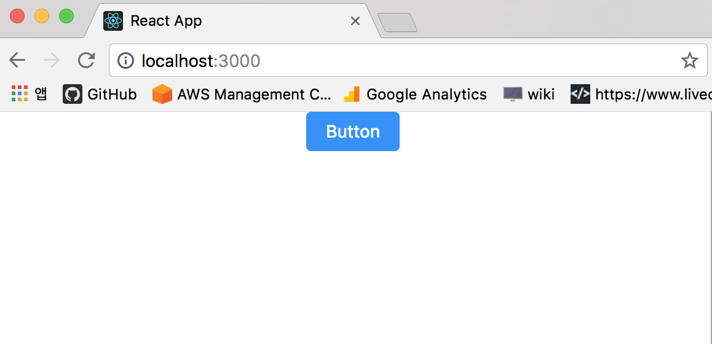

예전에 다른분이 추천을 하는 링크를 봐서 기억하고 있었는데 회사에서도 프론트 개발자분들이 주로 사용하는거 같아서 설정 방법을 알아봤다.

create-react-app 으로 주로 사용하고 있어서 설정하는 방법을 정리 해볼까 한다.

## 프로젝트 생성

`create-react-app`으로 프로젝트를 생성한다.

```bash
# app 생성
$ create-react-app antd-setting
# 디렉토리 이동
$ cd antd-setting
# app 실행
$ yarn start
```

## 프로젝트 구조

생성된 프로젝트의 구조는 다음과 같다.

```bash
.
├── README.md
├── package.json
├── public
│   ├── favicon.ico
│   ├── index.html
│   └── manifest.json
├── src
│   ├── App.css
│   ├── App.js
│   ├── App.test.js
│   ├── index.css
│   ├── index.js
│   ├── logo.svg
│   └── registerServiceWorker.js
└── yarn.lock
```

## antd 설치

```bash
$ yarn add antd
or
$ npm install antd --save
```

## css 설정하기

`antd/dist/antd.css`를 src/App.css 상위에 추가해 줍니다.

```css
@import '~antd/dist/antd.css';

.App {
  text-align: center;
}
```

## component 사용하기

`src/App.js`를 아래와 같이 수정해서 버튼을 추가해 보자.

```js
import React, { Component } from 'react'
import Button from 'antd/lib/button'
import './App.css'

class App extends Component {
  render() {
    return (
      <div className="App">
        <Button type="primary">Button</Button>
      </div>
    )
  }
}

export default App
```



위와 같이 버튼에 css 가 적용된걸 확인할 수 있다.

## react-app-rewired 설치하기

위와 같이 준비를 하면 antd 를 사용가능하지만 css 에서 모든 파일을 import 해서 쓰기 때문에 사용하지 않는 모든 파일을 가져오는건 낭비라고 생각한다. 그래서 webpack 에서 설정해서 필요한것들만 불러와서 사용하게 변경해보자.

그러기 위해서 `react-app-rewired` 라이브러리를 활용해보려고 한다.
이 라이브러리는 `create-react-app`으로 생성한 프로젝트에서 webpack 등 설정을 변경하려고 할때 eject 를 사용하지 않고 설정을 변경할 수 있게 도와주는 라이브러리다.

먼저 설치를 해보자.

```bash
$ yarn add react-app-rewired --dev
or
$ npm install react-app-rewired --save-dev
```

## babel-plugin-import 설치

```bash
$ yarn add babel-plugin-import --dev
or
$ npm install babel-plugin-import --save-dev
```

## package.json 수정하기

```diff
/* package.json */
"scripts": {
-   "start": "react-scripts start",
+   "start": "react-app-rewired start",
-   "build": "react-scripts build",
+   "build": "react-app-rewired build",
-   "test": "react-scripts test --env=jsdom",
+   "test": "react-app-rewired test --env=jsdom",
}
```

## config-overrides.js 파일 생성 & 수정

```diff
+ const { injectBabelPlugin } = require('react-app-rewired');

module.exports = function override(config, env) {

# css를 사용하는 경우
+   config = injectBabelPlugin(['import', { libraryName: 'antd', libraryDirectory: 'es', style: 'css' }], config);

# less를 사용하는 경우
+   config = injectBabelPlugin(["import", { "libraryName": "antd", "libraryDirectory": "es", "style": "css" }], config);
    return config;
};
```

## src/App.css import 제거

```css
- @import '~antd/dist/antd.css'; # 제거

.App {
  text-align: center;
}

...
```

위와 같이 설정을 해주면 각 component 에서 사용한 antd 컴포넌트만 import 해서 사용하기 때문에 리소스 다운로드 낭비를 막을수 있다.
