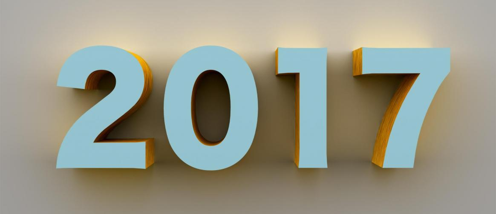

오늘 교회에서 `돌아보지 않으면 성장은 없다` 라는 목사님의 말씀을 듣고 2017 년을 돌아보며 처음으로 1 년 회고를 써보았다. 그동안은 새해가 되면 나에게 부족한것들에 대한 반성과 새로운 다짐은 없이 나는 작년에 모했지? 정도만 머리로 생각하고 넘겼었다. 이제 회사도 퇴사했고 10 년차에 접어들었으니 다시 한번 새로운 마음으로 정신차리고 신입의 마음으로 시작하고자 한다.

## 회사에서 첫 전사 발표

2016 년에 회사에 카페가 생기면서 정말 간단한 주문 서비스를 만들었었다. 하지만 새해가 되었고 동료들에게 좀 더 좋은 경험을 주고자 새로운 카페 주문 서비스를 리뉴얼 했다. 스탬프, 쿠폰 기능이 추가되고 전체 적인 UI 도 변경했다. 그리고 전사를 대상으로 첫 발표를 했다. 사람들도 나름 웃어주고 재밌는 새로운 경험이 였다.

## 인명구조 자격증

수영을 30 살넘어서 배우기 시작하고 재미를 붙이면서 최종 목표를 인명구조 자격증 따는걸로 정했었다. 하지만 2 주간 수업을 받아야 해서 회사를 다니면서는 역부족이라고 생각했었다. 하지만 좋은 팀원들과 있기에 가능했었다. 모두들 이해해 주고 나를 응원해 줬다. 결국 2 주간의 수업을 받았고 자격증을 취득했다. 2 주동안 많은건 느끼고 회사에 돌아가면 정말 일을 열심히 하겠다고 다짐도 했다.

## SRE(Site Reliability Engineering) 전직

회사에 입사할땐 프론트 개발자로 입사를 했지만 결국 백엔드 개발자로 툴도 만들고 API 도 만들고... 여러가지 일을 했다.
올해 말엔(3 개월이지만) 좋아하는 사람들과 SRE 라는 팀으로 일을했다. AWS 리소스를 Terraform 으로 관리하고 ChatOps 를 하기 위해서 Botkit 을 사용해 Slack 못을 만들기도 하고 레거시 서버들에 있는 서비스를 AWS 로 이전하기도 하고... 짧은 시간이 였지만 많은 경험을 했다. 하지만... 그들이 있었기에 가능했지 내 능력으로는 불가능한 일이였다고 생각한다.

## 인프라스터럭쳐 스터디

SRE 팀에 가면서 AWS 리소스를 Terraform 으로 관리하고 있었기 때문에 개발실 다수가 참여 하고 있는 스터디에 참여하게 되었다. [알라딘: 코드로 인프라 관리하기 - 효율적인 인프라 관리를 위한 자동화 방법](http://www.aladin.co.kr/shop/wproduct.aspx?ItemId=103384462) 책으로 스터디에 참여했다. 처음부터 참여하지 않아서... 많은걸 배우진 못했다. 그래도 Terraform 경험에 대해서 한번 발표를 해서 발표 경험을 +1 했다.

## 오픈소스 첫 풀 리퀘스트

프론트로 전직을 하기로 맘 먹으면서 이것저것 해보다 React 에서 주로 사용하는 css framework 를 찾아봤는데 antd 를 많이 사용하기도 하고 나름 맘에 들어서 사용해 보려고 튜토리얼을 따라해보고 있었다. 문서를 보면서 하고 있었는데 오타가 눈에 들어왔다. `src` 를 `scr` 로 써둔것이다. 오예~ 이것이 이삭줍기 인가~ 라고 생각하고 할줄도 모르는 영어라 asbubam 님의 도움을 받아서 PR([fixed typo error. by J2P · Pull Request #8542 · ant-design/ant-design · GitHub](https://github.com/ant-design/ant-design/pull/8542))을 보냈다.
하지만 github 에서 diff 코드를 수정한 코드로 표기 하면서 `이건 오타 아닌데~` 라며 메인터너가 댓글을 달았고 `내가 수정한거 아닌데~` 라고 하고 오해를 풀었다 ㅋㅋㅋ 정말 새로운 경험이 였고 이래서 사람들이 오픈소스에 기여를 하나보다 싶었다. 2018 년에도 기회가 된다면 오픈소스에 기여하고 싶다. 근데 PR 을 보내기 위해선 일부러 버그를 찾거나 오타를 찾는게 아니라 많이 사용해봐야 PR 도 가능한거 같다. 그래서 오픈소스를 자주 사용하고 많이 써봐야 겠다.

## 5 년 5 개월의 직장 생활의 끝

2012 년 7 월 입사를 해서 2018 년 12 월 18 일 퇴사를 했다. 5 년 5 개월 생각보다 긴 기간을 한 회사에 다녔다. 내가 입사할때 10 명의 사원이 있었는데 퇴사할때 200 명의 사원이 있었다. 참 신기한 경험이였다.

## 이직 준비

5 년 5 개월 만에 이력서를 쓰고 알고리즘 공부를 하다 보니 내가 그동안 얼마나 공부를 하지 않고 발전이 없었는지 깨닳게 되었다. 회사 일에만 너무 취중해서 만들기에 급급했던것이다. 지금 생각해보면 새로운걸 만들어도 새로운 기술들을 공부하면서 충분히 적용할 기회들이 있었던 것이다. 어느 개발자의 조언 처럼 `그냥 내가 안한거다`

이직 준비를 하면서 알고리즘에 대한 생각도 많이 바꼈다. 예전에 도대체 왜 면접 전에 알고리즘 문제 풀기를 하는지 이해를 못했지만 운동선수를 보면서 느꼈다. 운동선수들은 시합을 뛰기전에 매일매일 훈련을 하고 연습을 한다. 스포츠 스타들을 보면 무엇보다 기본기를 다지는데 많은 시간을 보내는거 같다. 그래서 개발자에게 기본기는 무엇일까? 연습은 무엇일까? 라는 생각을 해보니 알고리즘이 그 기본이고 연습인거 같았다. 그래서 이참에 알고리즘에 관심을 같고 지속적으로 연습하고 훈련해야 겠다는 생각을 했다.

이력서 또한 이직을 하기전에 쓰는게 아니라 평소에 항상 대가 한것들에 대해서 잘 정리하는 습관이 필요하다고 생각했다. 언제든 준비를 해야 여유가 생기고 자신감이 생긴다고 생각한다.

## 프론트 개발자로 전직

전 직장에서 마지막으로 내가 했던 일은 SRE 팀에서 AWS 리소스를 관리하고 자동화 하는 작업이 였다. 하지만 팀원들이 있었기에 같이 작업을 해서 가능했던 일이 였다고 생각한다. 퇴사를 한 나는 `과연 무엇이 하고 싶은것인가? 내가 가장 재밌게 할 수 있는 일은 무엇인가?` 많은 생각을 했고 9 년간 2 번이나 전직을 시도했던 프론트 개발자가 나의 최종점이라는 결론을 내렸다. 그동안 백엔드 개발도 하고 AWS 리소스 관리도 하느라 프론트 개발에 대한 많은것들을 잊어버렸고 새로운 기술에 대한 지식도 부족하지만 이직준비 하는 기간 최선을 다해서 프론트 개발자로 전직 하고 싶다.

## 결론

2017 년은 발전 없는 한해였다. 발전을 위해 무엇을 했는지 어떤 생각을 했는지 기록을 잘해야 겠다고 생각했다.
2018 년엔 매일 매일 나를 돌아보면서 어제 보다 성장한 오늘의 나를 만들기 위해서 노력해야 겠다.
