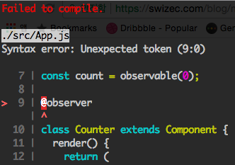

Mobx 를 공부해보려고 create-react-app 으로 프로젝트를 생성했다.
예제에 있는 코드를 입력하고 build 가 되길 기다렸는데 다음과 같은 에러가 발생했다.
decorator 가 정상적으로 동작하지 않는것이다.



decorator 는 es7 에 포함되는걸로 알고 있는데 create-react-app 기본 babel 설정에 es7 문법은 포함되어 있지 않은거 같다. 그래서 검색을 해보니 다음과 같이 해주면 decorator 를 사용할 수 있다는걸 알게 되었다.

## eject 로 프로젝트 설정을 모두 꺼낸다.

```bash
$ yarn run eject
```

## babel plugin 을 설치한다.

```bash
$ yarn add --dev babel-plugin-transform-decorators-legacy
```

## package.json 설정을 수정한다.

아래 babel 설정 부분에

```json
"babel": {
  "presets": [
    "react-app"
  ]
},
```

아래와 같이 추가 해준다.

```json
"babel": {
  "plugins": [
    "transform-decorators-legacy"
  ],
  "presets": [
    "react-app"
  ]
},
```

이제 정상적으로 decorators 가 동작한다.
