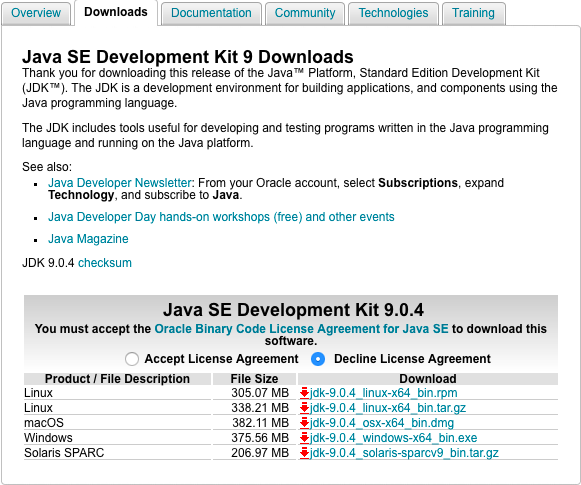
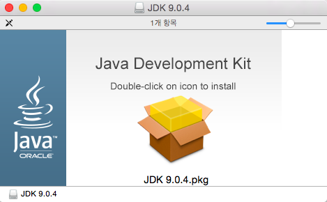

오늘 T 아카데미 토크 ON 세미나에서 selenium 을 실행하려고 했는데 다음과 같은 오류 메시지가 나왔다.

```bash
jjp5023:form-sample (git:master)$ yarn run selenium
yarn run v1.3.2
$ webdriver-manager update && webdriver-manager start
webdriver-manager: using local installed version 12.0.6
[16:48:20] I/file_manager - creating folder /Users/jjp5023/Study/js-debug-sample/form-sample/node_modules/webdriver-manager/selenium
[16:48:42] I/update - chromedriver: unzipping chromedriver_2.35.zip
[16:48:43] I/update - chromedriver: setting permissions to 0755 for /Users/jjp5023/Study/js-debug-sample/form-sample/node_modules/webdriver-manager/selenium/chromedriver_2.35
[16:49:53] I/update - geckodriver: unzipping geckodriver-v0.19.1.tar.gz
[16:49:53] I/update - geckodriver: setting permissions to 0755 for /Users/jjp5023/Study/js-debug-sample/form-sample/node_modules/webdriver-manager/selenium/geckodriver-v0.19.1
webdriver-manager: using local installed version 12.0.6
[16:49:54] I/start - java -Dwebdriver.chrome.driver=/Users/jjp5023/Study/js-debug-sample/form-sample/node_modules/webdriver-manager/selenium/chromedriver_2.35 -Dwebdriver.gecko.driver=/Users/jjp5023/Study/js-debug-sample/form-sample/node_modules/webdriver-manager/selenium/geckodriver-v0.19.1 -jar /Users/jjp5023/Study/js-debug-sample/form-sample/node_modules/webdriver-manager/selenium/selenium-server-standalone-3.8.1.jar -port 4444
[16:49:54] I/start - seleniumProcess.pid: 5831
Exception in thread "main" java.lang.UnsupportedClassVersionError: org/openqa/grid/selenium/GridLauncherV3 : Unsupported major.minor version 52.0
	at java.lang.ClassLoader.defineClass1(Native Method)
	at java.lang.ClassLoader.defineClass(ClassLoader.java:791)
	at java.security.SecureClassLoader.defineClass(SecureClassLoader.java:142)
	at java.net.URLClassLoader.defineClass(URLClassLoader.java:449)
	at java.net.URLClassLoader.access$100(URLClassLoader.java:71)
	at java.net.URLClassLoader$1.run(URLClassLoader.java:361)
	at java.net.URLClassLoader$1.run(URLClassLoader.java:355)
	at java.security.AccessController.doPrivileged(Native Method)
	at java.net.URLClassLoader.findClass(URLClassLoader.java:354)
	at java.lang.ClassLoader.loadClass(ClassLoader.java:423)
	at sun.misc.Launcher$AppClassLoader.loadClass(Launcher.java:308)
	at java.lang.ClassLoader.loadClass(ClassLoader.java:356)
	at sun.launcher.LauncherHelper.checkAndLoadMain(LauncherHelper.java:480)
[16:49:55] I/start - Selenium Standalone has exited with code 1
error Command failed with exit code 1.
info Visit https://yarnpkg.com/en/docs/cli/run for documentation about this command.
```

`Unsupported major.minor version` 어쩌구 저쩌구 하는거 보니 왠지 Java 버전 문제 같아서 Java 최신버전을 설치하는 방법을 알아봤다.

[Java SE Development Kit 9 - Downloads](http://www.oracle.com/technetwork/java/javase/downloads/jdk9-downloads-3848520.html) 에서 Java JDK 다운로드 받아서 설치한다.



받은 파일을 실행하면 다음과 같은 창이 뜨고 JDK 9.0.4.pkg 를 더블 클릭 하면 설치가 진행된다.



현재 Java 위치 확인

```bash
$ which java
/usr/bin/java
```

새로 설치된 JDK 는 `/Library/Java/JavaVirtualMachines/jdk-9.0.4.jdk/Contents/Home/bin/java` 여기에 설치 되었다.

이를 기존 Java 랑 바꿔줘야 한다.

기존 Java 를 삭제 하고 새로 설치된 Java 로 링크를 걸어준다.

```bash
$ sudo rm /usr/bin/java
$ sudo ln -s /Library/Java/JavaVirtualMachines/jdk-9.0.4.jdk/Contents/Home/bin/java /use/bin/java
```

이제 Java 버전을 확인 해보면 다음과 같이 새로운 버전을 확인 할 수 있다.

```bash
$ java -version
java version "9.0.4"
Java(TM) SE Runtime Environment (build 9.0.4+11)
Java HotSpot(TM) 64-Bit Server VM (build 9.0.4+11, mixed mode)
```

이제 selenium 을 실행할 수 있게 되었다. 오예~

```bash
20:52:20.368 INFO - Selenium Server is up and running
```
