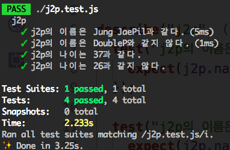
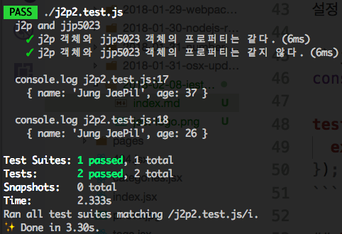

## toBe

기대치 값이 원하는 값인지 비교할 때 사용한다.
toBe 앞에 not 을 붙여주면 값이 같지 않음을 비교한다.

### 테스트 코드

```js
const j2p = {
  name: 'Jung JaePil',
  age: 37
};

describe('j2p', () => {
  test('j2p의 이름은 Jung JaePil과 같다.', () => {
    expect(j2p.name).toBe('Jung JaePil');
  });

  test('j2p의 이름은 DoubleP와 같지 않다.', () => {
    expect(j2p.name).not.toBe('DoubleP');
  });

  test('j2p의 나이는 37과 같다.', () => {
    expect(j2p.age).toBe(37);
  });

  test('j2p의 나이는 26과 같지 않다.', () => {
    expect(j2p.age).not.toBe(26);
  });
});
```

### 실행



## toEqual

두 객체의 값을 비교할 때 사용한다.
toEqual 앞에 not 을 붙여주면 같지 않음을 비교한다.

### 테스트 코드

아래와 같이 객체가 같을 때와 같지 않을때 비교를 할 수 있다.

```js
let j2p = {
  name: 'Jung JaePil',
  age: 37
};
let jjp5023 = {
  name: 'Jung JaePil',
  age: 37
};

describe('j2p and jjp5023', () => {
  test('j2p 객체와 jjp5023 객체의 프로퍼티는 같다.', () => {
    expect(j2p).toEqual(jjp5023);
  });

  test('j2p 객체와 jjp5023 객체의 프로퍼티는 같지 않다.', () => {
    jjp5023.age = 26;
    // 정확하게 확인하기 위해서 console.log 로 두 객체의 값을 찍어 봤다.
    console.log(j2p);
    console.log(jjp5023);
    expect(j2p).not.toEqual(jjp5023);
  });
});
```

### 실행


