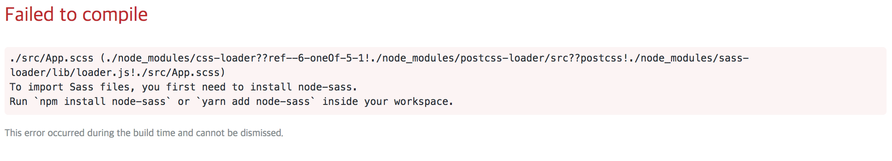

App.css 파일을 App.scss 파일로 변경하고 App.js 에서 import 해보자.



위와 같은 오류 메시지를 볼 수 있다.

오류에 친절하게도 설명이 있다. 
프로젝트 디렉토리에서 `node-sass` 패키지를 설치 하자.

``` bash
$ npm install node-sass
or
$ yarn add node-sass
```

이제 App.js 파일에서 App.scss 파일을 import 하면 scss 에 선언한 내용이 적용 된다.