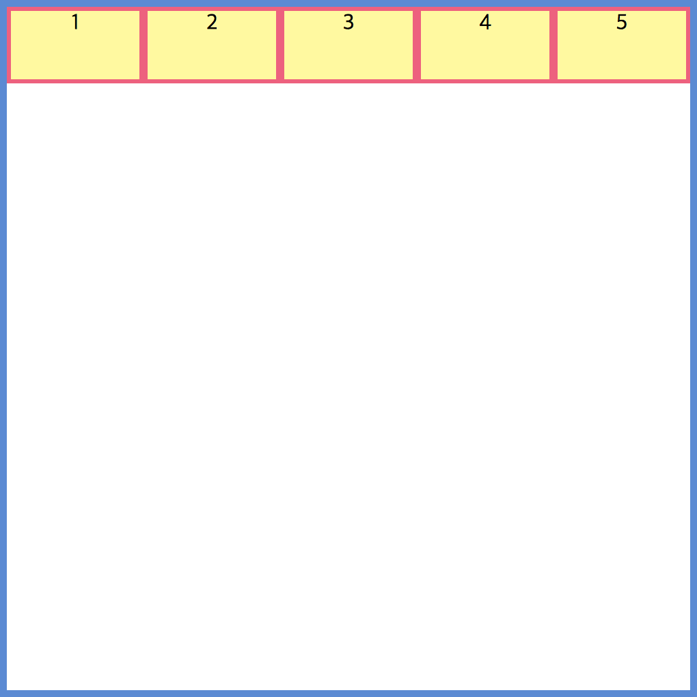
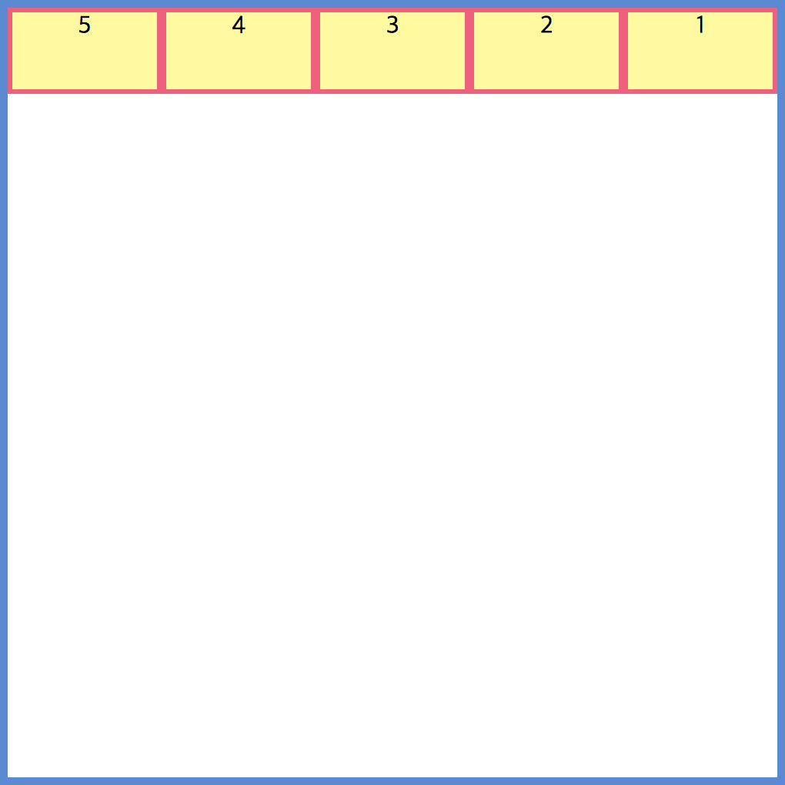
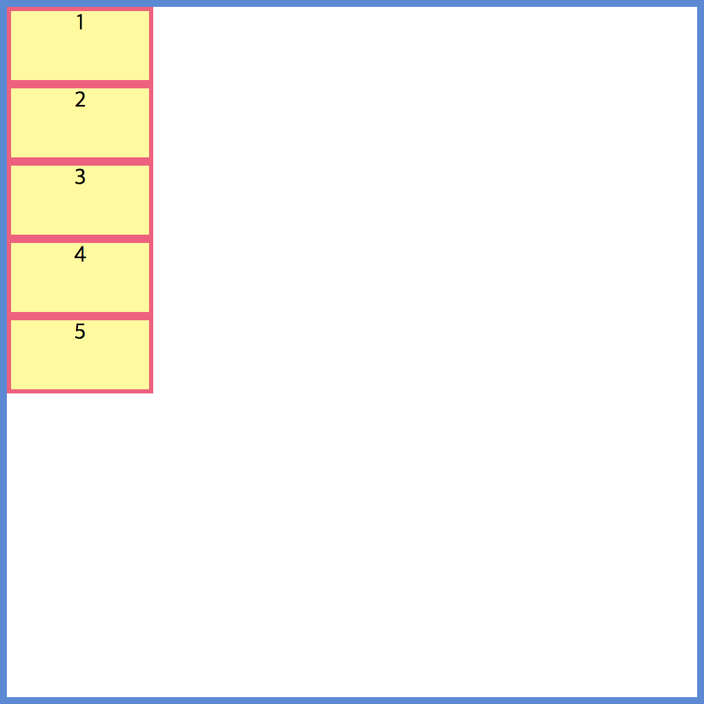
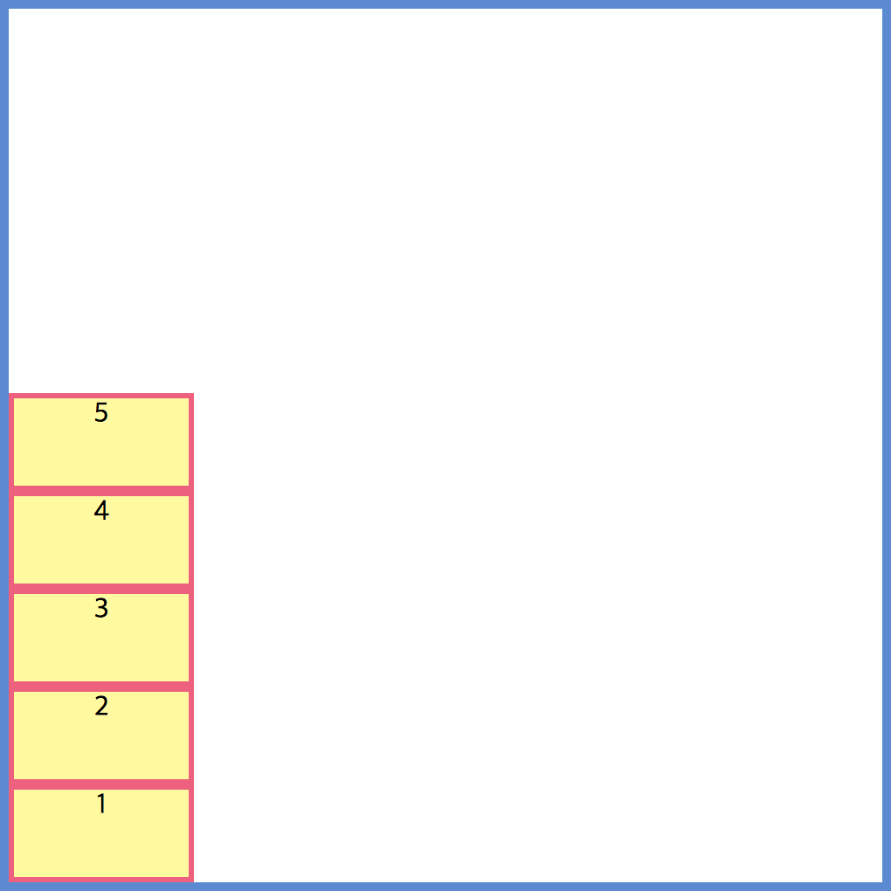

## flex-direction
flex container 내부에 자식 요소들을 어떻게 배열할 것인지를 설정하는 속성 값이다.

## values
* 값으로는 row, row-reverse, column, column-reverse 4개를 가질 수 있다.
* row 혹은 row-reverse를 선택하면 주축은 인라인 방향으로 행을 따른다고 한다.
* column 혹은 column-reverse 을 선택하면 주축은 페이지 상단에서 하단으로 블록 방향을 따른다고 한다.

## example
``` html
<!DOCTYPE html>
<html>
<head>
  <meta charset="UTF-8">
  <meta name="viewport" content="width=device-width, initial-scale=1.0">
  <meta http-equiv="X-UA-Compatible" content="ie=edge">
  <title>flex-direction example</title>
  <link rel="stylesheet" href="./style.css">
</head>
<body>
  <div class="container">
    <div>1</div>
    <div>2</div>
    <div>3</div>
    <div>4</div>
    <div>5</div>
  </div>
</body>
</html>
```

``` css
.container {
  border: 5px solid#4f8ad9;
  width: 500px;
  height: 500px;
  display: flex;
  /* 이곳에 flex-direction 속성값을 추가 해준다. */
  flex-direction: row | row-reverse | column | column-reverse
}

.container div {
  background: #fffa93;
  border: 3px solid #ff547d;
  width: 100px;
  height: 50px;
  text-align: center;
}
```

```
flex-direction: row;
```




```
flex-direction: row-reverse;
```




```
flex-direction: column;
```



```
flex-direction: column-reverse;
```

