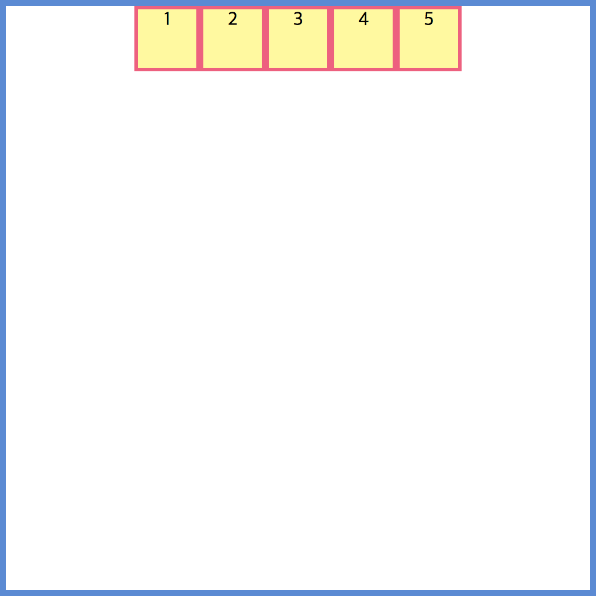

## justify-content
flex blox를 사용했을 때 자식 요소의 정렬을 정해주는 설정이다.

## Values
* `flex-start` 자식 요소들이 앞쪽 기준으로 나열된다. (default)
* `flex-end` 자식 요소들이 뒤쪽을 기준으로 나열 된다.
* `center`  자식 요소들이 가운데 기준으로 나열 된다.
* `space-around` 자식 요소들의 앞과 뒤 그리고 사이 사이에 공간을 두고 나열 된다.
* `space-between` 자식 요소들의 사이 사이에 공간을 두고 나열 된다.
* `space-evenly` 모든 자식 요소들의 사이 사이 똑같은 크기만큼 공간을 두고 나열 된다.

## Example
``` html
<!DOCTYPE html>
<html>
<head>
  <meta charset="UTF-8">
  <meta name="viewport" content="width=device-width, initial-scale=1.0">
  <meta http-equiv="X-UA-Compatible" content="ie=edge">
  <title>flex-direction example</title>
  <link rel="stylesheet" href="./style.css">
</head>
<body>
  <div class="container">
    <div>1</div>
    <div>2</div>
    <div>3</div>
    <div>4</div>
    <div>5</div>
  </div>
</body>
</html>
```

``` css
.container {
  border: 5px solid#4f8ad9;
  width: 500px;
  height: 500px;
  display: flex;
  flex-direction: row;
  /* row | column */
  justify-content: flex-start;
  /* flex-start flex-end center space-around space-between space-evenly */
}

.container div {
  background: #fffa93;
  border: 3px solid #ff547d;
  width: 50px;
  height: 50px;
  text-align: center;
}
```


``` css
justify-content: flex-start;
```


``` css
justify-content: flex-end;
```


``` css
justify-content: center;
```



``` css
justify-content: space-around;
```


``` css
justify-content: space-between;
```


``` css
justify-content: space-evenly;
```


## Use the flex-direction attribute value as a column.
``` css
flex-direction: column;
justify-content: flex-start;
```


``` css
flex-direction: column;
justify-content: flex-end;
```


``` css
flex-direction: column;
justify-content: center;
```


``` css
flex-direction: column;
justify-content: space-around;
```


``` css
flex-direction: column;
justify-content: space-between;
```


``` css
flex-direction: column;
justify-content: space-evenly;
```


