## Add deps to --info output ([#1720](https://github.com/denoland/deno/pull/1720))

### Deps type selection history
> Bert Belder 이 deps 모양에 대해서 3가지 제안을 했고 라이언이 Advanced를 선택했다.
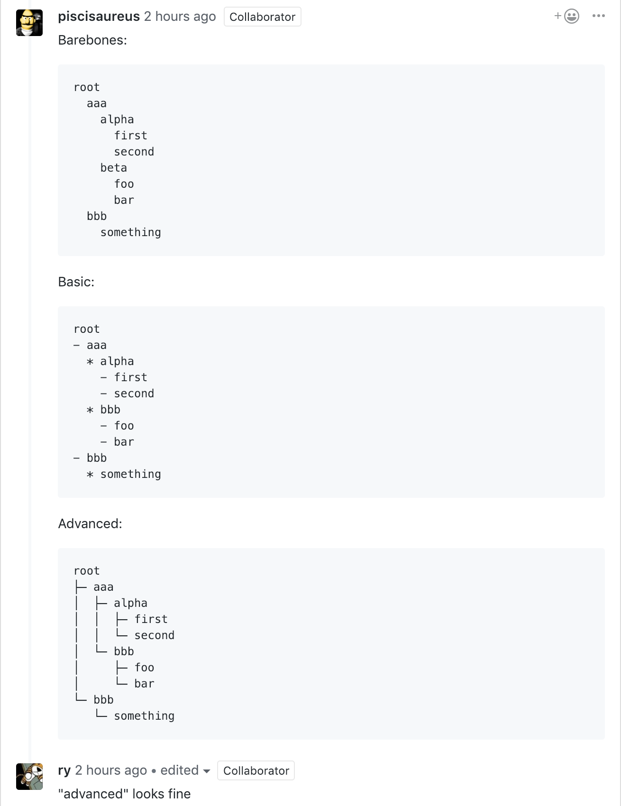

### Before
이전에는 local, type, compiled, map 만 보였다.
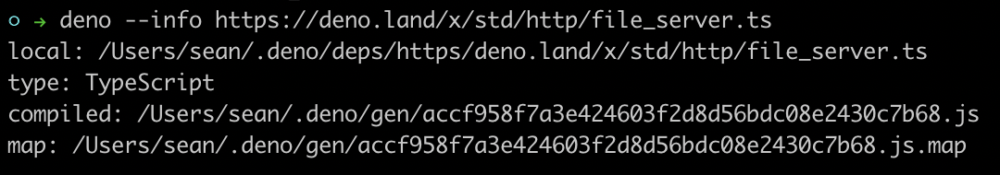

### After
이제는 deps가 추가 되어서 import 되는 모듈을 볼 수 있다.
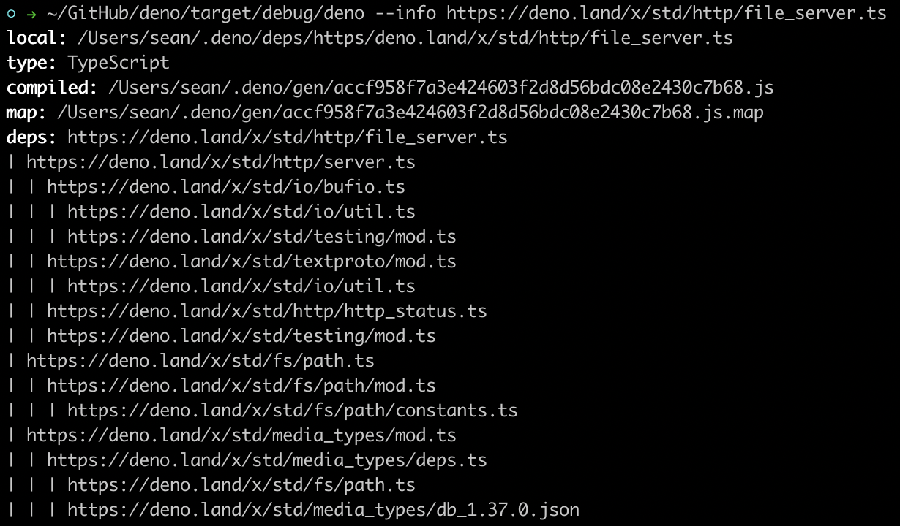


## Add --allow-read ([#1689](https://github.com/denoland/deno/pull/1689))

### Related Issue
[Add --allow-read #1225](https://github.com/denoland/deno/issues/1225)

### API to use --allow-read flag
> 아래 API 를 사용할 때는 --allow-read flag를 써줘야 한다.

* open
* read
* copyFile, copyFileSync
* lstat, lstatSync
* stat, statSync
* readDir, readDirSync
* readlink, readlinkSync
* readFile, readFileSync

### Before
이전에는 위 API를 사용해도 접근에 대해서 물어보지 않았다.
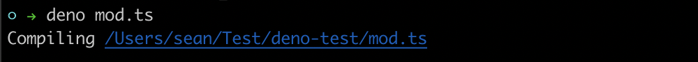

### After
이제는 위 API를 사용하면 아래와 같이 물어본다.
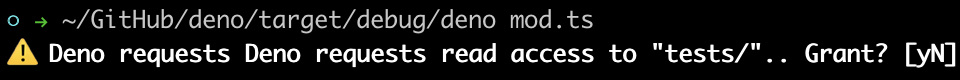

파일을 실행할 때 --allow-read flag를 사용하면 물어보지 않는다.
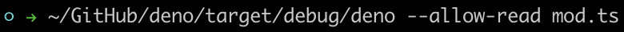


## Add deno.isTTY() ([#1622](https://github.com/denoland/deno/pull/1622))

### Related Issue
[Support checking if in a TTY](https://github.com/denoland/deno/issues/1607)

### How to use?
``` typescript
import { isTTY } from "deno";
console.log(isTTY().stdin);
```

## Add emojis to permission prompts ([#1684](https://github.com/denoland/deno/pull/1684))

### Related Issue
[Add color and/or emojis to permission prompt to make them more obvious #1651](https://github.com/denoland/deno/issues/1651)

### Before
이전에는 권한 사용에 대한 질문만 있다.
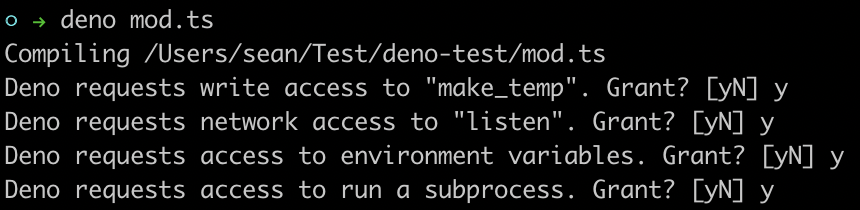
### After
이제는 ⚠️ 이모지가 앞에 표시 되고 있다.
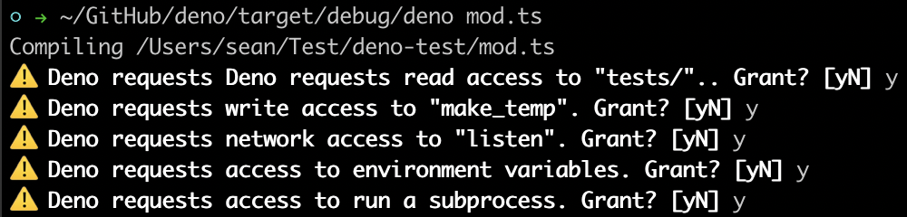


## Add basic WebAssembly support ([#1677](https://github.com/denoland/deno/pull/1677))

> WebAssembly를 지원하기 위해서 추가된 거 같다.

### How to use?

``` typescript
const wasmCode = new Uint8Array([
    0, 97, 115, 109, 1, 0, 0, 0, 1, 133, 128, 128, 128, 0, 1, 96, 0, 1, 127,
    3, 130, 128, 128, 128, 0, 1, 0, 4, 132, 128, 128, 128, 0, 1, 112, 0, 0,
    5, 131, 128, 128, 128, 0, 1, 0, 1, 6, 129, 128, 128, 128, 0, 0, 7, 145,
    128, 128, 128, 0, 2, 6, 109, 101, 109, 111, 114, 121, 2, 0, 4, 109, 97,
    105, 110, 0, 0, 10, 138, 128, 128, 128, 0, 1, 132, 128, 128, 128, 0, 0,
    65, 42, 11
  ]);

const wasmModule = new WebAssembly.Module(wasmCode);

const wasmInstance = new WebAssembly.Instance(wasmModule);

console.log(wasmInstance.exports.main().toString());
```

## Add NO_COLOR support ([#1716](https://github.com/denoland/deno/pull/1716))

> deno 에서는 환경변수 값을 확인하기 위해서 `--allow-env` flag를 사용해야 하는데
flag를 사용하지 않고 `NO_COLOR` 값을 확인하기 위해서 `deno.noColor`을 추가한 거 같다.

### Related Issue
* [Add colors to log module](https://github.com/denoland/deno_std/pull/175)
* [support NO_COLOR env var](https://github.com/denoland/deno/issues/1706)
* [https://no-color.org/](https://no-color.org/) 


### How to use?
``` typescript
import { noColor } from "deno";
console.log("noColor", noColor);
```

## Add color exceptions ([#1698](https://github.com/denoland/deno/pull/1698))
### Related Issue
[add color to exception messages #1652](https://github.com/denoland/deno/issues/1652)
### Before
이전에는 오류가 발생해도 아래와 같이 색 없이 보여줬다.
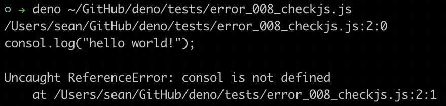
### After
이제는 오류 메시지도 색이 있어서 보기 좋아 졌다.
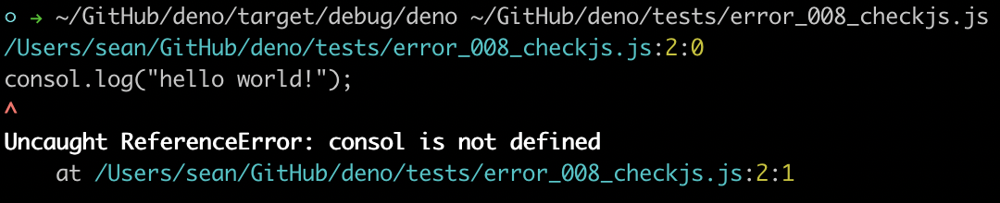


## do not load cache files when recompile flag is set ([#1695](https://github.com/denoland/deno/pull/1695))

### Related Issue
[Rust loads from cache with --recompile](https://github.com/denoland/deno/issues/1637)

### Before
이전에는 `--recompile` flag를 사용해도 아래 스샷 밑에서 두번째 라인 처럼 `load_cache code`를 하고 있었다.


### After
이제는 `load_cache code` 부분이 보이지 않는다.
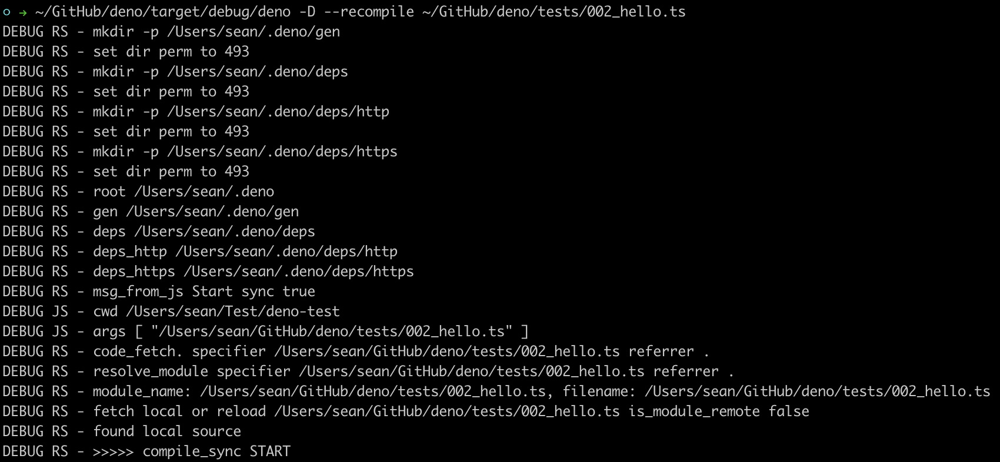


## Upgrade V8 to 7.4.98 ([#1640](https://github.com/denoland/deno/pull/1640))

### Related Issue
[Use kKeep for snapshot](https://github.com/denoland/deno/issues/814)