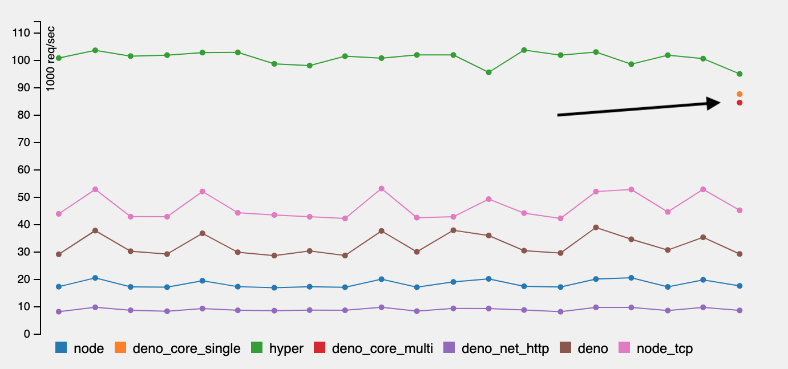

## Add import.meta.main 
- PR Link: [#1835](https://github.com/denoland/deno/pull/1835)
- Issue Link: [#1834](https://github.com/denoland/deno/issues/1834)
- Ref lin: [proposal-import-meta](https://github.com/tc39/proposal-import-meta)

> 기존에 추가된 `import.meta.url == window.location.toString ()` 사용해서 main 모듈인지 확인할 수 있지만
타이핑 하기 쉽고 확장가능 하도록 `import.meta.main` 가 추가 되었다.

### How to use?
```typescript
console.log(import.meta.url)
```

## Fix console.table display of Map 
- PR Link: [#1839](https://github.com/denoland/deno/pull/1839)

> console.table 사용시 Map에서 forEach 키와 값의 순서가 반대로 바뀌는 문제가 수정되었다.

## New low-level Rust API 
- PR Link: [#1827](https://github.com/denoland/deno/pull/1827)
- Issue Link: [#1834](https://github.com/denoland/deno/issues/1834)

> Deno 성능향상에 신경을 쓰고 작업중인거 같다.



## Upgrade V8 to 7.4.238 
- PR Link: [#1849](https://github.com/denoland/deno/pull/1849)
- Ref Link: [v8 7.4.238](https://github.com/v8/v8/releases/tag/7.4.238)

> V8 엔진 버전이 7.4.238로 업그레이드 되었다.

## Upgrade crates 
- PR Link: [#1848](https://github.com/denoland/deno/pull/1848)

> Rust crates들 버전이 업그레이드 되었다.

``` diff
- dirs = "1.0.4
+ dirs = "1.0.5

- http = "0.1.15"
+ http = "0.1.16"

- lazy_static = "1.2.0"
+ lazy_static = "1.3.0"

- libc = "0.2.48"
+ libc = "0.2.59"

- temfile = "3.0.6"
+ temfile = "3.0.7"
```